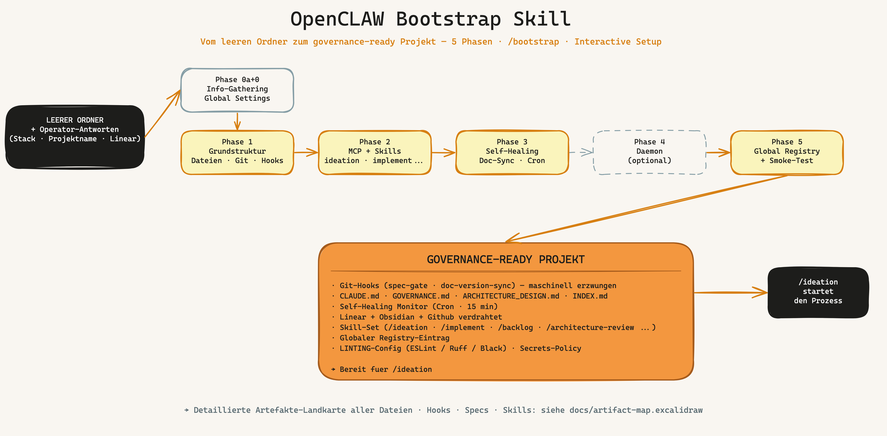
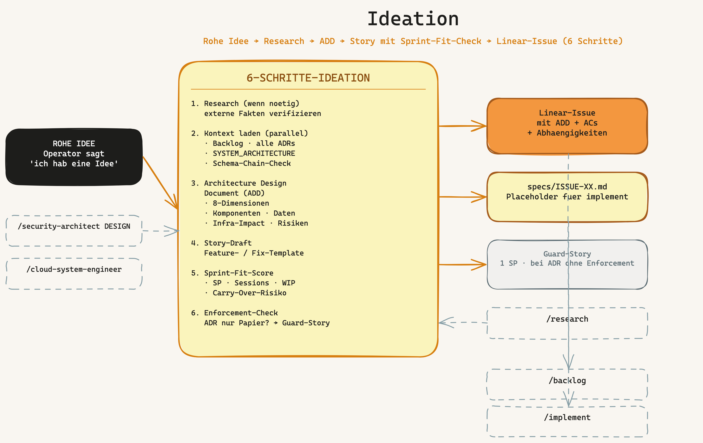
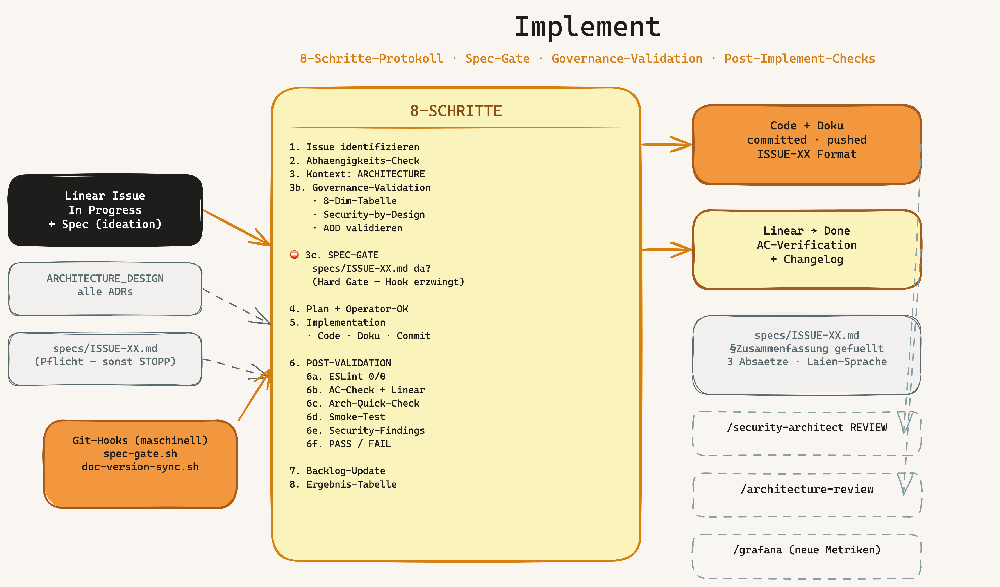
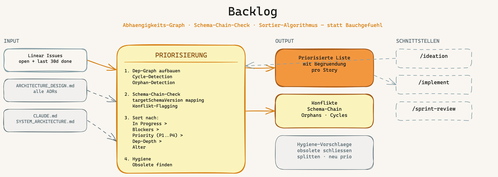
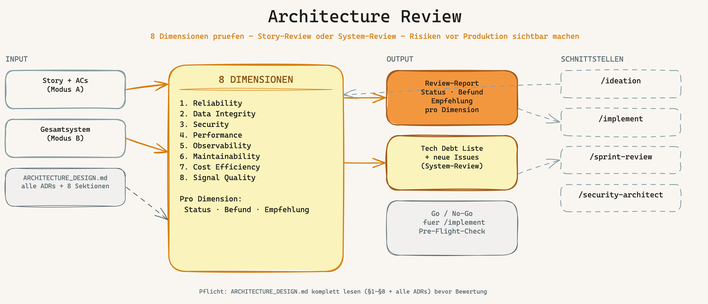
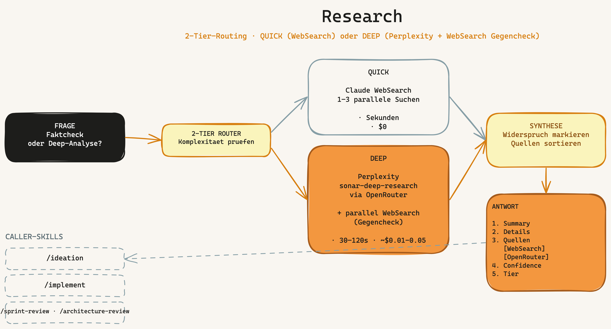
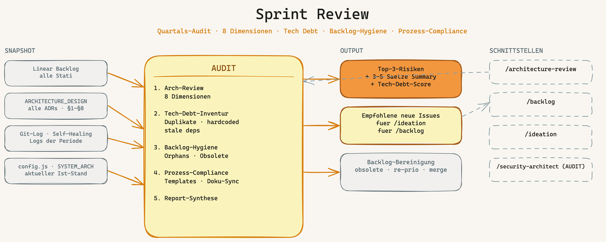
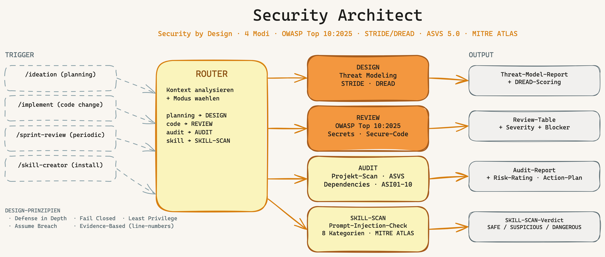
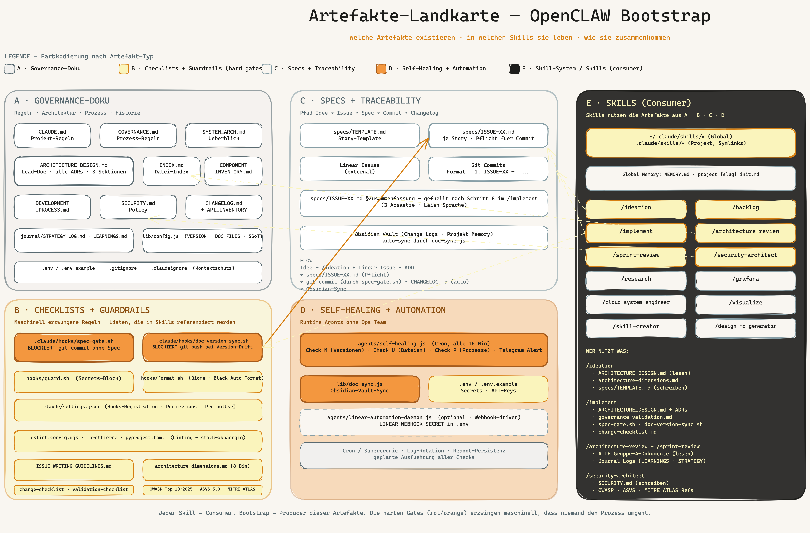
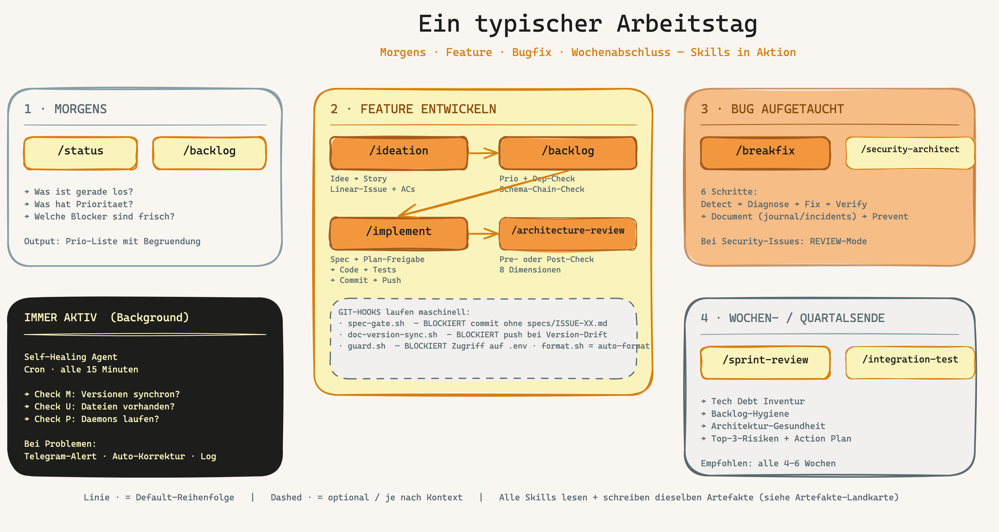

[🇬🇧 English](#english) · [🇩🇪 Deutsch](#deutsch)

---

<a name="english"></a>

# Governance for Vibe Coders — The Complete Handbook

> **Who is this handbook for?**
> You're a Vibe Coder — you have ideas, you use AI to build code, and you want to move fast.
> Governance sounds like bureaucracy. This handbook shows you why governance is actually your
> fastest tool — and how to set it up in 30 minutes.

---

## Table of Contents

1. [The Problem Without Governance](#1-the-problem-without-governance)
2. [What You Get](#2-what-you-get)
3. [Prerequisites and Preparation](#3-prerequisites-and-preparation)
4. [Installation — Step by Step](#4-installation--step-by-step)
5. [The Bootstrap Process](#5-the-bootstrap-process)
6. [The Skills — When Do I Use What?](#6-the-skills--when-do-i-use-what)
7. [The Artifacts — What Gets Created, Where, and Why](#7-the-artifacts--what-gets-created-where-and-why)
8. [The Guardrails — Your Safety Net](#8-the-guardrails--your-safety-net)
9. [VS Code Setup](#9-vs-code-setup)
10. [Tailoring Governance to Your Project](#10-tailoring-governance-to-your-project)
11. [Daily Usage — A Typical Workflow](#11-daily-usage--a-typical-workflow)
12. [FAQ](#12-faq) — incl. Claude Agent SDK migration

---

## 1. The Problem Without Governance

### What happens when you just start building

Imagine: you have a brilliant idea. You open Claude, say "build me X," and ten minutes later code is running. Brilliant.

Three weeks later:

- You can't remember why you made a particular decision
- You ask Claude about a bug — Claude doesn't know the context anymore
- You try to add a new feature and accidentally break something else
- You don't know which version of your project is "stable"
- You have 50 files, 3 half-finished features, and no plan

That's **not** an AI problem. That's a **missing-system** problem.

### The hidden truth about vibe coding

Vibe coding is powerful — but only if the AI understands **what you built** and **why**.
Without documentation and structure, every new session starts from zero.

**With governance** here's what happens:

- New session? Type `/status` — Claude sees everything instantly
- `/implement ISSUE-42` — Claude knows exactly what to do
- `/breakfix` — Claude diagnoses systematically
- Every change is traceable, every error has an audit trail

---

## 2. What You Get

### The OpenCLAW Governance Framework

A **complete operating system for AI-assisted software development**:

```
GitHub Repository (vibercoder79/KI-Masterclass-Koerting-)
├── bootstrap/           ← Sets everything up automatically
├── ideation/            ← From idea to story
├── implement/           ← From story to code
├── backlog/             ← Sprint planning & priorities
├── architecture-review/ ← Is my system healthy?
├── research/            ← Deep research with AI
├── sprint-review/       ← Periodic quality check
├── security-architect/  ← Threat modeling + code review
├── grafana/             ← Dashboards via MCP
├── cloud-system-engineer/ ← VPS · Docker · firewall
├── visualize/           ← Architecture diagrams in Miro
├── skill-creator/       ← Build your own skills
└── design-md-generator/ ← Extract design systems
```

### What that means concretely

| Without governance | With governance |
|--------------------|------------------|
| Claude forgets between sessions | Claude always knows the system |
| "Build me X" → random output | `/ideation` → structured story → `/implement` |
| Bugs appear out of nowhere | Self-healing agent monitors 24/7 |
| No idea if version is stable | Every change is versioned + documented |
| Rollback? What rollback? | Git + changelog = rollback anytime |
| 3 weeks later: total chaos | Sprint review keeps everything clean |

---

## 3. Prerequisites and Preparation

### Software you need

**Required:**

| Software | Purpose | Download |
|----------|---------|----------|
| **Claude Code CLI** | The heart — AI in the terminal | `npm install -g @anthropic-ai/claude-code` ¹ |
| **Node.js** (v18+) | Runtime for Claude Code | nodejs.org |
| **Git** | Version control | git-scm.com |

**Recommended:**

| Software | Purpose |
|----------|---------|
| **Visual Studio Code** | Editor with Claude Code integration |
| **GitHub account** | Your code repository |

### Accounts you need

**Required:**

1. **Anthropic account** — for Claude Code
   - Go to: claude.ai
   - Register → choose plan (Pro is enough to start)
   - API key at: console.anthropic.com → API Keys

2. **GitHub account** — for your repository
   - github.com/signup
   - Free tier is enough at the start

**Recommended:**

3. **Linear account** — for issue tracking (backlog, stories)
   - linear.app
   - Free for small teams
   - Linear API key: linear.app → Settings → API → Personal API Keys

**Optional but valuable:**

4. **OpenRouter account** — for cheaper LLM calls
   - openrouter.ai
   - Top up credit (~$10 goes a long way)
   - API key at: openrouter.ai/keys

### API keys — overview

Before you start `/bootstrap`, have these keys ready:

| Key | Required? | From | Variable |
|-----|-----------|------|----------|
| Anthropic API Key | YES | console.anthropic.com | `ANTHROPIC_API_KEY` |
| GitHub SSH Key | YES | `ssh-keygen` + GitHub Settings | — |
| Linear API Key | Recommended | linear.app → Settings → API | `LINEAR_API_KEY` |
| OpenRouter Key | Optional | openrouter.ai/keys | `OPENROUTER_API_KEY` |
| Telegram Bot Token | Optional | @BotFather on Telegram | `TELEGRAM_BOT_TOKEN` |

> **Security rule:** API keys NEVER go into code. They go into `.env` (this file is in `.gitignore`
> and will not be uploaded to GitHub).

> ¹ **Note on the Claude package:** The CLI tool is still called `@anthropic-ai/claude-code`.
> The new `@anthropic-ai/claude-agent-sdk` (npm) / `claude-agent-sdk` (pip) is for programmatic
> SDK use in your own apps — not for the CLI. Details: [FAQ → Claude Agent SDK](#what-is-the-claude-agent-sdk--do-i-need-to-migrate)

### Setting up SSH for GitHub

SSH is the secure connection between your machine and GitHub. Set it up once, never think about it again.

```bash
# 1. Create SSH key (if none exists yet)
ssh-keygen -t ed25519 -C "your@email.com"
# → Just press Enter for every question

# 2. Show public key
cat ~/.ssh/id_ed25519.pub
# → Copy this text entirely

# 3. Register with GitHub
# github.com → Settings → SSH and GPG Keys → New SSH Key → paste

# 4. Test connection
ssh -T git@github.com
# → "Hi username! You've successfully authenticated." = success
```

---

## 4. Installation — Step by Step

### Step 1: Install Claude Code

```bash
# Check Node.js version (must be 18+)
node --version

# Install Claude Code
npm install -g @anthropic-ai/claude-code

# Verify it works
claude --version
```

### Step 2: Configure Claude Code

```bash
# Launch Claude Code — first run will prompt for the API key
claude

# Alternative: set API key as environment variable
export ANTHROPIC_API_KEY="your-api-key-here"
```

> **Tip:** Put the `export` command into `~/.bashrc` or `~/.zshrc` so it's active in every new terminal.

### Step 3: Get the Bootstrap skill

This is the **only manual step** — after this, Claude does everything automatically.

```bash
# Pull bootstrap skill from the GitHub repository
mkdir -p /root/.claude/skills
cd /tmp
git clone --filter=blob:none --sparse git@github.com:vibercoder79/KI-Masterclass-Koerting-.git ki-skills
cd ki-skills
git sparse-checkout set bootstrap
cp -r bootstrap /root/.claude/skills/
cd /tmp && rm -rf ki-skills

# Verify the skill is there
ls /root/.claude/skills/bootstrap/
# → should show SKILL.md and a references/ folder
```

> **Why only the bootstrap skill?** The bootstrap skill automatically installs all other skills
> you'll need in phase 2. You don't have to pull them one by one.

### Step 4: Create a new project

```bash
# Create a directory for your new project
mkdir ~/my-project
cd ~/my-project

# Start Claude Code in the project directory
claude
```

### Step 5: Run bootstrap

In the Claude Code session:

```
/bootstrap
```

Claude now walks you through 14 questions (about 5 minutes) and then builds everything automatically.

---

## 5. The Bootstrap Process



*From empty folder to governance-ready project in 5 guided phases — governance hooks, skill set, self-healing monitor, and global registry entry included. ([Excalidraw source](bootstrap/docs/bootstrap-big-picture.excalidraw))*

### Phase 0: Questions & answers (you + Claude)

Bootstrap asks questions in two steps.

#### Step 1: Stack question — first of all

Before anything else, bootstrap asks:

```
What do you want to develop?

a) Node.js / JavaScript backend (API, CLI, daemon)
b) Frontend (React, Vue, Vanilla JS)
c) Full-stack (Node.js backend + frontend)
d) Python (AI/ML, scripts, FastAPI, Django)
e) Other / not clear yet
```

**Why first?** The answer determines which tools bootstrap sets up for you:

| Your choice | Linter | Formatter | Auto-created |
|-------------|--------|-----------|--------------|
| Node.js | ESLint | — | `eslint.config.mjs` |
| Frontend | ESLint + Prettier | Prettier | `eslint.config.mjs` + `.prettierrc` |
| Full-stack | ESLint + Prettier | Prettier | `eslint.config.mjs` + `.prettierrc` |
| Python | Ruff | Black | `pyproject.toml` |

At the end, bootstrap also tells you which VS Code extensions you need for your stack.

#### Step 2: Remaining questions (14 total)

Then everything else at once:

| Question | Example answer | Why it matters |
|----------|---------------|-----------------|
| Project name | `MyShop` | Used everywhere |
| Short description | `E-commerce for handmade products` | Claude understands what you're building |
| Project path | `/home/user/my-project` | Where the code lives |
| GitHub repository URL | `git@github.com:your-user/my-project.git` | For backup and versioning |
| Linear team name | `MyShop` | For issue tracking |
| Issue prefix | `SHOP` | Your stories will be SHOP-1, SHOP-2... |
| Start version | `1.0.0` | Versioning from day 1 |

**Skill selection:**

```
Which skills to install?
a) Minimum (ideation, implement, backlog)      ← Ideal for the start
b) Standard (+ architecture-review, sprint-review, research, breakfix)  ← Recommended
c) Full (all skills)                           ← If you want the full arsenal
d) Pick manually
```

> **Recommendation:** Start with **Standard (b)**. You can add more skills anytime.

### Phase 1: Base structure (automatic, ~2 min)

Claude creates all files — tooling files adjust to your stack automatically.

See the [Artifact Map](#7-the-artifacts--what-gets-created-where-and-why) for a visual overview of every file created and how they relate.

### Phase 2: Install skills (automatic)

Claude pulls the selected skills from GitHub.

### Phase 3: Set up self-healing (automatic)

An agent that checks every 15 minutes:

- Is everything running as planned?
- Are all docs up to date?
- Are there any inconsistencies?

Problems → Telegram alert (optional) or log entry.

### Phase 4: Automation daemon (optional)

If you use Linear + GitHub: a daemon that automatically implements code as soon as you set
an issue to "In Progress". Claude writes code, pushes, and closes the issue.

### Phase 5: Done

```
✓ Project structure created
✓ 7 skills installed
✓ Git hooks active
✓ Self-healing running
✓ Global registry updated

Your project is ready. Start with: /ideation
```

---

## 6. The Skills — When Do I Use What?

### Overview: the skill system

Skills are **repeatable workflows** that guide Claude through complex tasks. You invoke them
with `/skillname` and Claude follows a defined process.

```
Idea     → /ideation          → Story in Linear
Story    → /implement         → Code, tests, git push
Problem  → /breakfix          → Diagnosis, fix, prevention
Week     → /backlog           → What's next?
Quarter  → /sprint-review     → System health
Anytime  → /status            → What's happening right now?
```

Every skill in this handbook has its own README with a visual overview:

| Skill | README + Sketch |
|-------|-----------------|
| bootstrap | [README](bootstrap/README.md) · [Sketch](bootstrap/docs/bootstrap-big-picture.png) |
| ideation | [README](ideation/README.md) · [Sketch](ideation/overview.png) |
| implement | [README](implement/README.md) · [Sketch](implement/overview.png) |
| backlog | [README](backlog/README.md) · [Sketch](backlog/overview.png) |
| architecture-review | [README](architecture-review/README.md) · [Sketch](architecture-review/overview.png) |
| sprint-review | [README](sprint-review/README.md) · [Sketch](sprint-review/overview.png) |
| research | [README](research/README.md) · [Sketch](research/overview.png) |
| security-architect | [README](security-architect/README.md) · [Sketch](security-architect/overview.png) |
| grafana | [README](grafana/README.md) · [Sketch](grafana/overview.png) |
| cloud-system-engineer | [README](cloud-system-engineer/README.md) · [Sketch](cloud-system-engineer/overview.png) |
| visualize | [README](visualize/README.md) · [Sketch](visualize/overview.png) |
| skill-creator | [README](skill-creator/README.md) · [Sketch](skill-creator/overview.png) |
| design-md-generator | [README](design-md-generator/README.md) · [Sketch](design-md-generator/overview.png) |

### `/ideation` — From idea to story



**When:** You have an idea for a new feature.

**What happens:**
1. You describe your idea in natural language
2. Claude researches (optional: deep research via Perplexity)
3. Claude checks whether the idea fits the architecture
4. Claude creates a structured user story in Linear

**Example:**
```
You: /ideation
Claude: "Describe your idea..."
You: "I want customers to be able to track their orders"

→ Claude creates SHOP-42 in Linear with:
   - What exactly gets built
   - Why (business value)
   - How (technical approach)
   - Acceptance criteria
   - Effort estimation
```

### `/implement` — From story to code



**When:** You want to implement a story.

**What happens (8-step protocol):**
1. Identify issue (load from Linear)
2. Dependency check (blockers resolved?)
3. Build context (CLAUDE.md, ARCHITECTURE_DESIGN.md)
3b. Governance validation (8-dimension table? Security section?)
3c. ⛔ **Spec-file gate** — hard gate (enforced by `spec-gate.sh`)
4. Plan + operator approval
5. Implementation (code, docs, commit + push)
6. Post-implement validation (ESLint, AC check, smoke test, security findings)
7. Backlog update
8. Result table + `specs/ISSUE-XX.md` summary

> **Important:** `/implement` NEVER changes code without your OK in step 4. You're always in control.

### `/backlog` — Sprint planning



**When:** You don't know what's most important next.

**What happens:**
1. Claude loads all open issues from Linear
2. Analyzes dependencies (what blocks what?)
3. Suggests a prioritized order
4. Schema-chain check: flags conflicts (two stories targeting same `schemaVersion`)
5. Shows hygiene suggestions (orphaned refs, obsolete issues)

### `/breakfix` — When something is broken

**When:** The system has a problem, a bug, or is acting weird.

**What happens (6-step process):**
1. **Detect:** What exactly is the problem?
2. **Diagnose:** Why is it happening?
3. **Fix:** Implement the solution
4. **Verify:** Is it truly fixed?
5. **Document:** Archive incident in `journal/incidents/`
6. **Prevent:** How do we prevent this in the future?

### `/architecture-review` — System health



**When:** Before a big decision. Periodically (monthly).

**What happens:** Claude checks 8 dimensions of your system — Reliability, Data Integrity,
Security, Performance, Observability, Maintainability, Cost Efficiency, Signal Quality.

### `/research` — Deep research



**When:** You need facts for a technical decision.

**What happens:**
- Auto-routing: simple questions → WebSearch, complex → Perplexity (deeper AI analysis)
- Results are cross-checked
- Structured research report with sources + confidence rating

### `/sprint-review` — Quarterly audit



**When:** Every 4–6 weeks.

**What happens:**
- Tech debt analysis: what needs cleanup?
- Backlog hygiene: which issues are stale?
- Architecture check: has tech debt accumulated?
- Recommendations for the coming weeks

### `/security-architect` — Security by design



**When:** Automatically — during planning (DESIGN mode), code changes (REVIEW mode),
audits (AUDIT mode), and before installing external skills (SKILL-SCAN mode).

**Covers:** OWASP Top 10:2025 · STRIDE/DREAD · ASVS 5.0 · MITRE ATLAS · Agentic AI Security (ASI01–ASI10)

### Other skills

- [`/grafana`](grafana/README.md) — dashboards via Grafana MCP
- [`/cloud-system-engineer`](cloud-system-engineer/README.md) — VPS, Docker, firewall, DNS
- [`/visualize`](visualize/README.md) — architecture diagrams in Miro
- [`/skill-creator`](skill-creator/README.md) — build your own skills
- [`/design-md-generator`](design-md-generator/README.md) — extract design systems to DESIGN.md
- [`/status`](bootstrap/README.md) — one-glance system status

---

## 7. The Artifacts — What Gets Created, Where, and Why

### What is an artifact?

An **artifact** is a file that the governance framework creates or expects — documentation,
checklists, hooks, specs, automation scripts, memory entries. Each artifact has a clear
purpose and is read or written by specific skills.

Most teams collect documentation ad-hoc. OpenCLAW defines a fixed, minimal set of artifacts
that together give you traceable, reproducible, AI-friendly development.

### The 5 artifact groups



*The full artifact map: every governance file, hook, spec, and automation that bootstrap creates — grouped into 5 categories, with arrows showing which skill consumes which artifact. ([Excalidraw source](bootstrap/docs/artifact-map.excalidraw))*

#### Group A — Governance documentation

Rules · architecture · process · history.

| Artifact | Purpose | Written by | Read by |
|----------|---------|------------|---------|
| `CLAUDE.md` | Claude's identity + project rules | bootstrap + you | every skill (auto at session start) |
| `GOVERNANCE.md` | Process rules — when/why | bootstrap | every skill |
| `SYSTEM_ARCHITECTURE.md` | Overview of components, data flow | bootstrap + `/implement` | every skill |
| `ARCHITECTURE_DESIGN.md` | Lead document — all ADRs, 8 sections | bootstrap + `/ideation` | `/implement`, `/architecture-review`, `/sprint-review` |
| `INDEX.md` | File index | bootstrap + `/implement` | every skill |
| `COMPONENT_INVENTORY.md` | Component inventory | bootstrap + `/implement` | self-healing (Check U) |
| `DEVELOPMENT_PROCESS.md` | Process reference | bootstrap | reference |
| `SECURITY.md` | Security policy | bootstrap + `/security-architect` | `/implement`, `/sprint-review` |
| `CHANGELOG.md` | What changed when | `/implement` (auto) | every skill |
| `API_INVENTORY.md` | All external APIs | `/implement` | `/security-architect` (AUDIT) |
| `journal/STRATEGY_LOG.md` | Strategy decisions | you + `/ideation` | `/ideation` (mandatory read before story creation) |
| `journal/LEARNINGS.md` | Outcome tracking | `/implement` (after issue-close) | `/sprint-review` |
| `lib/config.js` | Single source of truth: VERSION + DOC_FILES | bootstrap | self-healing, doc-version-sync |

#### Group B — Checklists + guardrails

Machine-enforced rules and reference lists.

| Artifact | Purpose | Enforcement |
|----------|---------|-------------|
| `.claude/hooks/spec-gate.sh` | Blocks `git commit ISSUE-XX` without `specs/ISSUE-XX.md` | **HARD GATE** (PreToolUse hook) |
| `.claude/hooks/doc-version-sync.sh` | Blocks `git push` on VERSION drift between DOC_FILES | **HARD GATE** (PreToolUse hook) |
| `.claude/hooks/guard.sh` | Blocks access to `.env` and key files | Soft guard |
| `.claude/hooks/format.sh` | Auto-formats on Edit/Write (Biome/Black) | Passive |
| `.claude/settings.json` | Hook registration + permissions | Config |
| `eslint.config.mjs` / `.prettierrc` / `pyproject.toml` | Linting config (stack-dependent) | Passive + `/implement` step 6a |
| `.claude/ISSUE_WRITING_GUIDELINES.md` | Issue format rules | Reference |
| `ideation/references/architecture-dimensions.md` | The 8 dimensions | Reference for `/ideation`, `/architecture-review` |
| `implement/references/change-checklist.md` | Per-change validation | Reference for `/implement` step 6 |
| `security-architect/references/owasp-checklist.md` | OWASP Top 10:2025 + ASVS 5.0 | Reference for `/security-architect` |

#### Group C — Specs + traceability

The path Idea → Issue → Spec → Commit → Changelog.

| Artifact | Purpose | Anatomy |
|----------|---------|---------|
| `specs/TEMPLATE.md` | Template for new specs | Why · What · Constraints · Current State · Tasks (T1, T2…) |
| `specs/ISSUE-XX.md` | One spec per story (mandatory before commit) | Filled from TEMPLATE + `## Summary` filled by `/implement` step 8 |
| Linear Issues | External story tracking | Feature template or Fix/refactor template |
| Git Commits | Format: `T1: ISSUE-XX — description` | Gated by spec-gate.sh |
| Obsidian Vault | Change logs + project memory | Auto-synced by `doc-sync.js` |

#### Group D — Self-healing + automation

Runtime agents — no ops team needed.

| Artifact | Purpose | Cadence |
|----------|---------|---------|
| `agents/self-healing.js` | Check M (versions) · U (files) · P (processes) + Telegram alert | Cron, every 15 min |
| `lib/doc-sync.js` | Sync to Obsidian vault | On demand + cron |
| `.env` / `.env.example` | Secrets + API keys (gitignored) | Manual |
| `agents/linear-automation-daemon.js` | Webhook-driven auto-implement | Optional |

#### Group E — Skill system

Skills consume artifacts from A–D.

| Artifact | Purpose |
|----------|---------|
| `~/.claude/skills/*` | Global skill registry |
| `.claude/skills/*` | Project-local symlinks |
| `~/.claude/projects/-root/memory/MEMORY.md` | Global memory |
| `~/.claude/projects/-root/memory/project_{slug}_init.md` | Project-specific memory |

### How to read an artifact — anatomy example: `specs/ISSUE-XX.md`

Every spec file follows the same structure:

```markdown
# SHOP-42 — Order tracking

## Why
Customers frequently ask "where is my order?" via email. Adding a tracking page
reduces support load and improves UX.

## What
- Deliverable: `/orders/:id/track` page with live status
- Done when: customer sees status + timestamps + carrier link

## Constraints
- MUST: reuse existing order DB schema
- MUST NOT: add new external API without approval
- Out of scope: email notifications (separate story)

## Current State
- `src/routes/orders.js` — currently handles list/detail views
- `lib/order-db.js` — schema v12

## Tasks
- T1: Add `/orders/:id/track` route (files: src/routes/orders.js) — verify by visiting /orders/1/track
- T2: Add tracking status component (files: components/OrderTracking.jsx) — verify by Storybook
- T3: Wire carrier API (files: lib/carrier-api.js, .env.example) — verify by mock response

## Summary
(filled after implementation by /implement step 8 — 3 paragraphs, plain language)
```

This structure is not negotiable — the spec-gate hook enforces the file's existence, and
`/implement` step 3c validates its shape before the plan phase begins.

### Which skill writes/reads which artifact?

The [Artifact Map](bootstrap/docs/artifact-map.png) above shows the full matrix visually.
Quick summary:

- **`/ideation`** writes: Linear issue, ADD section, spec placeholder. Reads: ARCHITECTURE_DESIGN.md, STRATEGY_LOG.md
- **`/implement`** writes: code, specs/ISSUE-XX.md (summary), CHANGELOG.md, LEARNINGS.md. Reads: spec, ARCHITECTURE_DESIGN.md, change-checklist
- **`/architecture-review`** reads: ALL group-A docs + ADD + all ADRs. Writes: review report
- **`/sprint-review`** reads: ALL group-A docs + LEARNINGS.md + Git log. Writes: audit report
- **`/security-architect`** writes: SECURITY.md updates, threat models. Reads: OWASP checklist, STRIDE refs

### The golden rule

> **Every artifact has one purpose. Every skill consumes or writes specific artifacts.
> No skill writes into an artifact it doesn't own. No artifact is duplicated.**

This is the whole framework in one sentence.

---

## 8. The Guardrails — Your Safety Net

### What are guardrails?

Guardrails are **automatic safety mechanisms** that prevent you from accidentally doing
things you'll regret. Not punishment — your parachute.

### Guardrail 1: Spec-gate (Git hook)

**Problem:** You change code without knowing why — and in 3 weeks you won't remember.

**Solution:** Before you can commit code tied to an issue, a spec file (`specs/SHOP-42.md`)
must exist that explains **what** and **why**.

```bash
git commit -m "SHOP-42: Add order tracking"
# → Without specs/SHOP-42.md: BLOCKED
# → With specs/SHOP-42.md: allowed

# ⛔ spec-gate: specs/SHOP-42.md missing!
#    Create specs/SHOP-42.md from specs/TEMPLATE.md first
#    Bypass: git commit --no-verify (only if you're consciously skipping)
```

**Bypass available?** Yes: `--no-verify`. But you consciously know you're breaking the rule.

### Guardrail 2: Doc-version-sync (Git hook)

**Problem:** You bump the version in `config.js` but forget 5 documentation files.

**Solution:** When `config.js` is staged with a new version, the hook automatically checks
whether all docs are on the same version.

```bash
git commit -m "v1.4.0 - new features"
# → config.js: VERSION = '1.4.0'
# → SYSTEM_ARCHITECTURE.md: Version: 1.3.2 → BLOCKED

# ⛔ doc-version-sync: SYSTEM_ARCHITECTURE.md still at v1.3.2!
#    Please update to v1.4.0
```

### Guardrail 3: Self-healing agent

An agent that checks every 15 minutes in the background:

| Check | What's checked |
|-------|-----------------|
| Signal freshness | Is all data current? |
| Doc sync | Are all doc versions in sync? |
| Architecture guard | Are core rules respected? |
| API health | Are all external APIs reachable? |
| Security events | Was there suspicious activity? |

On problems: Telegram alert (if set up) or log entry in `journal/`.

### Guardrail 4: Spec-driven development

The simplest yet most powerful rule:

```
NEVER change code without a Linear issue
NEVER commit code without a spec file (specs/ISSUE-ID.md)
NEVER bypass the operator (= you) — always show, then act
```

Sounds like extra work. In practice, a spec file takes 2 minutes — and prevents hours of
debug work because you know what you built and why.

### Guardrail 5: Operator in the loop

On `/implement`: **step 4 is always a pause point.** Claude shows you the plan, you say OK,
then code is written.

You can never accidentally deploy something you haven't seen.

---

## 9. VS Code Setup

### Claude Code extension

The official Claude Code extension for VS Code integrates everything directly into your editor:

- Terminal with Claude Code directly in VS Code
- File context automatically passed to Claude
- Inline code suggestions
- Invoke `/implement` directly from the editor

**Installation:**
```
VS Code → Extensions → search "Claude Code" → Install
```

### Base plugins (always, for every stack)

Install these 3 plugins **once** — they work for all projects:

**1. ESLint** — coding rules in real time
→ https://marketplace.visualstudio.com/items?itemName=dbaeumer.vscode-eslint
- Checks your code against the rules in `eslint.config.mjs`
- Shows errors and warnings directly in the editor
- **Tie to governance:** `/implement` calls ESLint after every change — errors block the commit

**2. SonarQube for IDE (SonarLint)** — deeper analysis
→ https://marketplace.visualstudio.com/items?itemName=SonarSource.sonarlint-vscode
- Analyzes deeper patterns: code smells, potential bugs, security vulnerabilities
- Works passively in the background — no manual start needed
- Finds what ESLint doesn't — SQL injection, hardcoded credentials, unsafe crypto

**3. Error Lens** — no more hiding
→ https://marketplace.visualstudio.com/items?itemName=usernamehw.errorlens
- Shows ESLint and SonarLint findings **inline** — not just on hover
- Red line = error. Yellow line = warning. Immediately visible, not ignorable.

### Stack-specific plugins

Depending on what you're developing:

**Node.js / JavaScript backend:**
→ REST Client (test API endpoints from VS Code) — https://marketplace.visualstudio.com/items?itemName=humao.rest-client

**Frontend (React, Vue, Vanilla JS):**
→ Prettier (auto-format on save)
→ Auto Rename Tag
→ CSS Peek

**Python:**
→ Python (required) · Black Formatter · Ruff · Error Lens · SonarLint · Pylance · Jupyter (optional)

> **Tip:** Bootstrap gives you the appropriate links at the end of setup — just click and install.

---

## 10. Tailoring Governance to Your Project

### The central config file: `lib/config.js`

Everything runs through a single file — the **Single Source of Truth (SSoT)** principle.

```javascript
// lib/config.js — example structure after bootstrap

module.exports = {
  // Project identity
  PROJECT_NAME: 'MyShop',
  VERSION: '1.0.0',           // ← This number drives ALL version numbers

  // Linear integration
  LINEAR_TEAM: 'MyShop',
  LINEAR_PREFIX: 'SHOP',

  // Documentation files (auto-checked against VERSION)
  DOC_FILES: [
    { path: 'SYSTEM_ARCHITECTURE.md', versionPattern: /\*\*Version:\*\*\s*([\d.]+)/ },
    { path: 'CHANGELOG.md', versionPattern: /## v([\d.]+)/ },
    // more docs...
  ],

  // Your own configurations
  APP: { port: 3000, environment: 'development' }
};
```

**Most important rule:** When you bump `VERSION`, all `DOC_FILES` must be updated to the new
version. The doc-version-sync hook enforces this automatically.

### Custom skills

With `/skill-creator` you can build project-specific workflows:

```
/skill-creator

"I want a skill that compares our product prices to competitors daily
 and creates a report."

→ Claude creates /price-monitor skill with the right workflow
```

---

## 11. Daily Usage — A Typical Workflow



*Morning · feature · bugfix · end of week — skills in action. ([Excalidraw source](docs/daily-workflow.excalidraw))*

### Morning: what's on?

```bash
cd ~/my-project
claude

/status
/backlog
```

Claude shows: open issues, system health, what happened recently.

### Build a feature

```
Step 1 — Formalize the idea:
/ideation
→ "I want to build X because..."
→ Claude creates SHOP-XX in Linear

Step 2 — Implement:
/implement SHOP-XX
→ Claude shows plan → You approve → code is written
→ Automatically: tests, git push, Linear issue closed

Step 3 — Verify:
/integration-test
→ All checks green? Good.
```

### A bug appeared?

```
/breakfix
→ Describe the problem
→ Claude diagnoses
→ Implement fix
→ Incident documented
→ Preventive measure installed
```

### End of the week

```
/sprint-review
→ What did we do this week?
→ What's tech debt?
→ Priorities for next week
```

### Example: a complete day

```
09:00  /status          → All green, 3 open issues
09:05  /backlog         → SHOP-38 has highest priority (payment bug)
09:10  /implement SHOP-38
09:12  → Claude shows plan: "Implement session token refresh"
09:13  → You: "Yes, go"
09:25  → Code implemented, tested, pushed, issue closed
09:30  /integration-test → All 12 checks green
10:00  /ideation        → New idea: newsletter system
10:15  → SHOP-55 created in Linear
11:00  /implement SHOP-55
...
17:00  /sprint-review   → Week review
```

---

## 12. FAQ

### "I'm not a developer. Does this still work for me?"

Yes. Skills are designed so you don't need deep technical knowledge. You describe what you
want in natural language — Claude handles the technical implementation. Governance makes
sure the approach is still structured and safe.

### "What if I make a mistake and something breaks?"

That's what `/breakfix` is for. And because every change is in Git, every step can be undone:

```bash
git revert HEAD
git log --oneline     # → shows all commits
git checkout <hash>   # → go back to this state
```

### "Do I really have to create an issue for every small feature?"

For tiny typos: no. For anything that takes more than 10 minutes: yes.

The effort for an issue is 2 minutes with `/ideation`. The effort for an undocumented feature
that causes problems in 3 months: hours.

### "Can I have multiple projects?"

Yes. Bootstrap sets up a self-contained environment for each project. Claude Code knows which
project is active based on the working directory.

### "What does this cost?"

| Service | Cost |
|---------|------|
| Claude Code CLI | Included in Claude Pro |
| GitHub | Free |
| Linear | Free (hobby plan) |
| OpenRouter | Pay-as-you-go (~$0.001/request) |
| Telegram bot | Free |

For a small project: **$0 to ~$5/month.**

### "What if I find the governance rules annoying?"

All guardrails have a `--no-verify` bypass. You can skip them — but consciously.

The goal isn't control, it's **deliberate action**. If you know "I'm breaking this rule right
now because X," that's good. If you break rules accidentally without noticing — that's the
problem governance prevents.

### What is the Claude Agent SDK — do I need to migrate?

The **Claude Agent SDK** (`@anthropic-ai/claude-agent-sdk`) is the renamed successor package to
`@anthropic-ai/claude-code` (npm) and `claude-code-sdk` (pip). It's a rebranding with some
breaking changes in v0.1.0.

**Who needs to migrate?**

| Use case | Migration needed? |
|----------|-------------------|
| Using Claude Code as **CLI tool** (`claude` in terminal, skills, hooks) | **No** — nothing to do |
| Importing Claude Code as **library** in your own code | **Yes** — rename package and imports |

**The OpenCLAW framework and this handbook use Claude Code exclusively as a CLI tool.**
If you use `/bootstrap`, `/implement`, or other skills, you are **not affected**.

Only if you build your own apps importing `@anthropic-ai/claude-code` or `claude-code-sdk`
programmatically do you need to migrate:

```bash
npm uninstall @anthropic-ai/claude-code
npm install @anthropic-ai/claude-agent-sdk
```

```typescript
// Before
import { query } from "@anthropic-ai/claude-code";
// After
import { query } from "@anthropic-ai/claude-agent-sdk";
```

Three breaking changes in v0.1.0:
- System prompt no longer auto-loaded
- Settings sources no longer auto-read
- Python: `ClaudeCodeOptions` → `ClaudeAgentOptions`

Migration guide: https://platform.claude.com/docs/en/agent-sdk/migration-guide

### "How do I update skills when new versions come out?"

```bash
# Update only bootstrap (same as first time)
cd /tmp
git clone --filter=blob:none --sparse git@github.com:vibercoder79/KI-Masterclass-Koerting-.git ki-skills
cd ki-skills
git sparse-checkout set bootstrap
cp -r bootstrap /root/.claude/skills/
cd /tmp && rm -rf ki-skills

# In Claude Code: bootstrap can update existing skills
/bootstrap --update
```

---

## Appendix A: Pre-bootstrap checklist

```
Before /bootstrap:

SOFTWARE:
☐ Node.js v18+ installed (node --version)
☐ Git installed (git --version)
☐ Claude Code installed (claude --version)

ACCOUNTS:
☐ Anthropic account + API key
☐ GitHub account + SSH key set up (ssh -T git@github.com)
☐ Linear account + API key (optional but recommended)

INFORMATION READY:
☐ Project name (e.g. "MyShop")
☐ Short project description (1–2 sentences)
☐ Desired project path
☐ GitHub repository URL (new empty repo created)
☐ Linear team name (if used)
☐ Desired issue prefix (e.g. "SHOP")

BOOTSTRAP SKILL:
☐ /root/.claude/skills/bootstrap/ present
☐ SKILL.md visible in this folder
```

## Appendix B: Important files cheat sheet

| File | Purpose | When to touch |
|------|---------|----------------|
| `CLAUDE.md` | AI personality & rules | Setup, big changes |
| `lib/config.js` | All configurations | Version bumps, new settings |
| `specs/TEMPLATE.md` | Story template | Reference |
| `specs/ISSUE-XX.md` | Story spec | Before every implementation |
| `CHANGELOG.md` | What changed when | Auto by `/implement` |
| `API_INVENTORY.md` | All external APIs | On every new API integration |
| `.env` | API keys & secrets | Initial + on new keys |
| `journal/` | All logs & incidents | Read only / written by tools |

## Appendix C: Glossary

| Term | Meaning |
|------|---------|
| **SSoT** | Single Source of Truth — one authoritative source per information |
| **Governance** | Rules and processes that keep a system healthy |
| **Spec** | Spec file — short doc describing what and why is being built |
| **Issue** | A task/story in Linear |
| **Git hook** | Automatic check that runs on Git commands |
| **Self-healing** | System that detects and (when possible) fixes problems itself |
| **Daemon** | A process running continuously in the background |
| **Vibe coding** | AI-assisted development where AI writes most of the code |
| **Artifact** | File with a defined purpose in the governance framework (docs, hooks, specs, scripts) |

---

*This handbook is part of the OpenCLAW Governance Framework.*
*GitHub: github.com/vibercoder79/KI-Masterclass-Koerting-*

---

---

<a name="deutsch"></a>

# Governance für Vibe Coder — Das komplette Handbuch

> **Für wen ist dieses Handbuch?**
> Du bist Vibe Coder — du hast Ideen, du nutzt KI um Code zu bauen, und du willst schnell
> vorankommen. Governance klingt nach Bürokratie. Dieses Handbuch zeigt dir, warum Governance
> dein schnellstes Werkzeug ist — und wie du es in 30 Minuten aufgesetzt hast.

---

## Inhaltsverzeichnis

1. [Das Problem ohne Governance](#1-das-problem-ohne-governance)
2. [Was du bekommst](#2-was-du-bekommst)
3. [Voraussetzungen und Vorbereitung](#3-voraussetzungen-und-vorbereitung)
4. [Installation — Schritt für Schritt](#4-installation--schritt-für-schritt)
5. [Der Bootstrap-Prozess](#5-der-bootstrap-prozess)
6. [Die Skills — wann nutze ich was?](#6-die-skills--wann-nutze-ich-was)
7. [Die Artefakte — was entsteht, wo, und warum](#7-die-artefakte--was-entsteht-wo-und-warum)
8. [Die Guardrails — dein Sicherheitsnetz](#8-die-guardrails--dein-sicherheitsnetz)
9. [VS Code Setup](#9-vs-code-setup)
10. [Governance für dein Projekt anpassen](#10-governance-für-dein-projekt-anpassen)
11. [Tägliche Nutzung — ein typischer Workflow](#11-tägliche-nutzung--ein-typischer-workflow)
12. [Häufige Fragen](#12-häufige-fragen) — inkl. Claude Agent SDK Migration

---

## 1. Das Problem ohne Governance

### Was passiert wenn du einfach drauf los baust

Stell dir vor: Du hast eine großartige Idee. Du öffnest Claude, sagst "Bau mir X" und in 10 Minuten läuft Code. Genial.

Drei Wochen später:

- Du weißt nicht mehr, warum du eine Entscheidung so getroffen hast
- Du fragst Claude nach einem Bug — Claude kennt den Kontext nicht mehr
- Du willst eine neue Funktion hinzufügen und zerstörst dabei was anderes
- Du weißt nicht, welche Version deines Projekts "stabil" ist
- Du hast 50 Dateien, 3 halbfertige Features und keinen Plan mehr

Das ist **nicht** das Problem von KI. Das ist das Problem von **fehlendem System**.

### Die versteckte Wahrheit über Vibe Coding

Vibe Coding ist mächtig — aber nur wenn die KI versteht **was du gebaut hast** und **warum**.
Ohne Dokumentation und Struktur gibt jede neue Session bei null an.

**Mit Governance** passiert folgendes:
- Du sagst in einer neuen Session: `/status` — Claude sieht sofort alles
- Du sagst: `/implement ISSUE-42` — Claude weiß genau was zu tun ist
- Du sagst: `/breakfix` — Claude diagnostiziert strukturiert
- Jede Änderung ist nachvollziehbar, jeder Fehler hat einen Audit-Trail

---

## 2. Was du bekommst

### Das OpenCLAW Governance Framework

Ein **vollständiges Betriebssystem für KI-gestützte Softwareentwicklung**:

```
GitHub Repository (vibercoder79/KI-Masterclass-Koerting-)
├── bootstrap/        ← Richtet alles automatisch ein
├── ideation/         ← Von der Idee zur Story
├── implement/        ← Von der Story zum Code
├── backlog/          ← Sprint Planning & Prioritäten
├── breakfix/         ← Wenn etwas kaputt ist
├── architecture-review/  ← Ist mein System gesund?
├── research/         ← Deep Research mit KI
├── sprint-review/    ← Regelmäßige Qualitätskontrolle
├── integration-test/ ← Automatische Tests nach jeder Änderung
└── status/           ← System-Überblick auf Knopfdruck
```

### Was das konkret bedeutet

| Ohne Governance | Mit Governance |
|----------------|----------------|
| Claude vergisst zwischen Sessions | Claude kennt das System immer |
| "Bau mir X" → irgendwas entsteht | `/ideation` → strukturierte Story → `/implement` |
| Bugs tauchen aus dem Nichts auf | Self-Healing Agent überwacht 24/7 |
| Keine Ahnung ob Version stabil | Jede Änderung ist versioniert + dokumentiert |
| Rollback? Welches Rollback? | Git + Changelog = jederzeit zurückrollbar |
| 3 Wochen später: komplettes Chaos | Sprint Review hält alles sauber |

---

## 3. Voraussetzungen und Vorbereitung

### Software die du brauchst

**Pflicht:**

| Software | Wozu | Download |
|----------|------|---------|
| **Claude Code CLI** | Das Herzstück — KI im Terminal | `npm install -g @anthropic-ai/claude-code` ¹ |
| **Node.js** (v18+) | Runtime für Claude Code | nodejs.org |
| **Git** | Versionskontrolle | git-scm.com |

**Empfohlen:**

| Software | Wozu |
|----------|------|
| **Visual Studio Code** | Editor mit Claude Code Integration |
| **GitHub Account** | Dein Code-Repository |

### Accounts die du brauchst

**Pflicht:**

1. **Anthropic Account** — für Claude Code
   - Gehe zu: claude.ai
   - Registrieren → Plan wählen (Pro reicht für den Start)
   - API Key unter: console.anthropic.com → API Keys

2. **GitHub Account** — für dein Repository
   - github.com/signup
   - Kostenlos reicht für den Anfang

**Empfohlen:**

3. **Linear Account** — für Issue Tracking (Backlog, Stories)
   - linear.app
   - Kostenlos für kleine Teams
   - Linear API Key: linear.app → Settings → API → Personal API Keys

**Optional aber wertvoll:**

4. **OpenRouter Account** — für günstigere LLM-Calls
   - openrouter.ai
   - Guthaben aufladen (~$10 reichen lange)
   - API Key unter: openrouter.ai/keys

### API Keys — Übersicht

Bevor du mit `/bootstrap` startest, halte diese Keys bereit:

| Key | Pflicht? | Woher | Variable |
|-----|---------|-------|----------|
| Anthropic API Key | JA | console.anthropic.com | `ANTHROPIC_API_KEY` |
| GitHub SSH Key | JA | `ssh-keygen` + GitHub Settings | — |
| Linear API Key | Empfohlen | linear.app → Settings → API | `LINEAR_API_KEY` |
| OpenRouter Key | Optional | openrouter.ai/keys | `OPENROUTER_API_KEY` |
| Telegram Bot Token | Optional | @BotFather auf Telegram | `TELEGRAM_BOT_TOKEN` |

> **Sicherheitsregel:** API Keys kommen NIEMALS in den Code. Sie landen in `.env` (diese Datei ist
> in `.gitignore` — wird nicht auf GitHub hochgeladen).

> ¹ **Hinweis zum Claude-Paket:** Das CLI-Tool heißt weiterhin `@anthropic-ai/claude-code`.
> Das neue `@anthropic-ai/claude-agent-sdk` (npm) / `claude-agent-sdk` (pip) ist für
> programmatische SDK-Nutzung in eigenen Apps — nicht für das CLI. Details: [FAQ → Claude Agent SDK](#was-ist-das-claude-agent-sdk--muss-ich-migrieren)

### SSH für GitHub einrichten

SSH ist die sichere Verbindung zwischen deinem Rechner und GitHub. Einmal einrichten, nie wieder denken.

```bash
# 1. SSH Key erstellen (falls noch nicht vorhanden)
ssh-keygen -t ed25519 -C "deine@email.com"
# → Einfach Enter drücken für alle Fragen

# 2. Public Key anzeigen
cat ~/.ssh/id_ed25519.pub
# → Diesen Text komplett kopieren

# 3. Auf GitHub eintragen
# github.com → Settings → SSH and GPG Keys → New SSH Key → Text einfügen

# 4. Verbindung testen
ssh -T git@github.com
# → "Hi username! You've successfully authenticated." = Erfolg
```

---

## 4. Installation — Schritt für Schritt

### Schritt 1: Claude Code installieren

```bash
# Node.js Version prüfen (muss 18+ sein)
node --version

# Claude Code installieren
npm install -g @anthropic-ai/claude-code

# Prüfen ob es funktioniert
claude --version
```

### Schritt 2: Claude Code einrichten

```bash
# Claude Code starten — beim ersten Start wirst du nach dem API Key gefragt
claude

# Alternativ: API Key als Environment Variable setzen
export ANTHROPIC_API_KEY="dein-api-key-hier"
```

> **Tipp:** Den `export` Befehl in deine `~/.bashrc` oder `~/.zshrc` eintragen, damit er
> bei jedem Terminal-Start aktiv ist.

### Schritt 3: Bootstrap Skill holen

Das ist der **einzige manuelle Schritt** — danach macht Claude alles automatisch.

```bash
# Bootstrap Skill vom GitHub Repository holen
mkdir -p /root/.claude/skills
cd /tmp
git clone --filter=blob:none --sparse git@github.com:vibercoder79/KI-Masterclass-Koerting-.git ki-skills
cd ki-skills
git sparse-checkout set bootstrap
cp -r bootstrap /root/.claude/skills/
cd /tmp && rm -rf ki-skills

# Prüfen ob der Skill da ist
ls /root/.claude/skills/bootstrap/
# → Sollte SKILL.md und einen references/ Ordner zeigen
```

> **Warum nur den Bootstrap Skill?** Der Bootstrap Skill installiert in Phase 2 automatisch
> alle weiteren Skills die du brauchst. Du musst nicht jeden einzeln holen.

### Schritt 4: Neues Projekt anlegen

```bash
# Verzeichnis für dein neues Projekt erstellen
mkdir ~/mein-projekt
cd ~/mein-projekt

# Claude Code im Projektverzeichnis starten
claude
```

### Schritt 5: Bootstrap ausführen

In der Claude Code Session:

```
/bootstrap
```

Claude führt dich jetzt durch 14 Fragen (ca. 5 Minuten) und baut danach alles automatisch auf.

---

## 5. Der Bootstrap-Prozess


*Vom leeren Ordner zum governance-ready Projekt in 5 geführten Phasen — Governance-Hooks, Skill-Set, Self-Healing-Monitor und globaler Registry-Eintrag inklusive. ([Excalidraw-Quelle](bootstrap/docs/bootstrap-big-picture.excalidraw))*

### Phase 0: Fragen & Antworten (du + Claude)

Bootstrap stellt die Fragen in zwei Schritten.

#### Schritt 1: Stack-Frage — als allererstes

Bevor alles andere fragt Bootstrap:

```
Was möchtest du entwickeln?

a) Node.js / JavaScript Backend (API, CLI, Daemon)
b) Frontend (React, Vue, Vanilla JS)
c) Full-Stack (Node.js Backend + Frontend)
d) Python (KI/ML, Scripts, FastAPI, Django)
e) Anderes / Noch nicht klar
```

**Warum zuerst?** Die Antwort bestimmt welche Werkzeuge Bootstrap für dich einrichtet:

| Deine Wahl | Linter | Formatter | Wird automatisch angelegt |
|-----------|--------|-----------|--------------------------|
| Node.js | ESLint | — | `eslint.config.mjs` |
| Frontend | ESLint + Prettier | Prettier | `eslint.config.mjs` + `.prettierrc` |
| Full-Stack | ESLint + Prettier | Prettier | `eslint.config.mjs` + `.prettierrc` |
| Python | Ruff | Black | `pyproject.toml` |

Am Ende sagt Bootstrap dir auch welche VS Code Extensions du für deinen Stack brauchst.

#### Schritt 2: Restliche Fragen (14 Stück)

Danach kommen alle weiteren Infos auf einmal:

| Frage | Beispiel-Antwort | Warum wichtig |
|-------|-----------------|---------------|
| Projektname | `MeinShop` | Wird überall verwendet |
| Kurze Beschreibung | `E-Commerce für handgemachte Produkte` | Claude versteht was du baust |
| Projekt-Pfad | `/home/user/mein-projekt` | Wo der Code landet |
| GitHub Repository URL | `git@github.com:dein-user/mein-projekt.git` | Für Code-Backup und Versionierung |
| Linear Team Name | `MeinShop` | Für Issue-Tracking |
| Issue-Prefix | `SHOP` | Deine Stories heißen SHOP-1, SHOP-2... |
| Start-Version | `1.0.0` | Versionierung ab Tag 1 |

**Skills-Auswahl:**

```
Welche Skills installieren?
a) Minimum (ideation, implement, backlog)      ← Für den Start ideal
b) Standard (+ architecture-review, sprint-review, research, breakfix)  ← Empfohlen
c) Voll (alle Skills)                          ← Wenn du das volle Arsenal willst
d) Manuell auswählen
```

> **Empfehlung:** Starte mit **Standard (b)**. Du kannst jederzeit weitere Skills nachrüsten.

### Phase 1: Grundstruktur (automatisch, ~2 Minuten)

Claude erstellt alle Dateien — die Tooling-Dateien passen sich automatisch deinem Stack an:

```
dein-projekt/
├── lib/
│   └── config.js           ← Zentrale Konfiguration (SSoT)
├── agents/
│   └── self-healing.js     ← Überwacht dein System
├── journal/                ← Alle Logs
├── specs/
│   └── TEMPLATE.md         ← Vorlage für neue Features
├── docs/                   ← Technische Dokumentation
├── .claude/
│   ├── skills/             ← Deine installierten Skills
│   └── hooks/              ← Git-Governance-Regeln
├── CLAUDE.md               ← "Wer bin ich?" für die KI
├── SYSTEM_ARCHITECTURE.md
├── API_INVENTORY.md
├── INDEX.md
├── CHANGELOG.md
├── GOVERNANCE.md
├── SECURITY.md
├── .env.example            ← API Key Template
│
│   ── Stack-abhängig (automatisch) ──
├── eslint.config.mjs       ← Node.js / Frontend / Full-Stack
├── .prettierrc             ← nur Frontend / Full-Stack
└── pyproject.toml          ← nur Python (Black + Ruff)
```

**Die wichtigste Datei: `CLAUDE.md`**

Das ist der "Personalausweis" deines Projekts für die KI. Jedes Mal wenn du eine neue
Claude-Session startest, liest Claude diese Datei und kennt sofort:
- Was dein Projekt ist
- Welche Regeln gelten
- Wo welche Dateien sind
- Was zuletzt passiert ist

### Phase 2: Skills installieren (automatisch)

Claude lädt die gewählten Skills von GitHub:

```
Installing skills...
✓ ideation
✓ implement
✓ backlog
✓ architecture-review
✓ sprint-review
✓ research
✓ breakfix
```

### Phase 3: Self-Healing einrichten (automatisch)

Ein Agent der alle 15 Minuten automatisch prüft:
- Läuft alles wie geplant?
- Sind alle Docs auf dem neuesten Stand?
- Gibt es Inkonsistenzen?

Bei Problemen bekommst du einen Telegram-Alert (optional) oder einen Log-Eintrag.

### Phase 4: Automation Daemon (optional)

Wenn du Linear + GitHub nutzt: Ein Daemon der automatisch Code implementiert, sobald du
ein Issue auf "In Progress" setzt. Claude schreibt dann selbstständig Code, pusht ihn und
schließt das Issue.

### Phase 5: Fertig

```
✓ Projekt-Struktur angelegt
✓ 7 Skills installiert
✓ Git Hooks aktiv
✓ Self-Healing läuft
✓ Globale Registry aktualisiert

Dein Projekt ist bereit. Starte mit: /ideation
```

---

## 6. Die Skills — wann nutze ich was?

### Übersicht: Das Skill-System

Skills sind **wiederholbare Workflows** die Claude durch komplexe Aufgaben führen.
Du rufst sie mit `/skillname` auf und Claude folgt einem definierten Prozess.

```
Idee → /ideation → Story in Linear
Story → /implement → Code, Tests, Git Push
Problem → /breakfix → Diagnose, Fix, Prevention
Woche → /backlog → Was steht an?
Quartal → /sprint-review → System-Gesundheit
Jederzeit → /status → Was läuft gerade?
```

Jeder Skill hat eine eigene README mit visueller Übersicht:

| Skill | README + Sketch |
|-------|-----------------|
| bootstrap | [README](bootstrap/README.md) · [Sketch](bootstrap/docs/bootstrap-big-picture.png) |
| ideation | [README](ideation/README.md) · [Sketch](ideation/overview.png) |
| implement | [README](implement/README.md) · [Sketch](implement/overview.png) |
| backlog | [README](backlog/README.md) · [Sketch](backlog/overview.png) |
| architecture-review | [README](architecture-review/README.md) · [Sketch](architecture-review/overview.png) |
| sprint-review | [README](sprint-review/README.md) · [Sketch](sprint-review/overview.png) |
| research | [README](research/README.md) · [Sketch](research/overview.png) |
| security-architect | [README](security-architect/README.md) · [Sketch](security-architect/overview.png) |
| grafana | [README](grafana/README.md) · [Sketch](grafana/overview.png) |
| cloud-system-engineer | [README](cloud-system-engineer/README.md) · [Sketch](cloud-system-engineer/overview.png) |
| visualize | [README](visualize/README.md) · [Sketch](visualize/overview.png) |
| skill-creator | [README](skill-creator/README.md) · [Sketch](skill-creator/overview.png) |
| design-md-generator | [README](design-md-generator/README.md) · [Sketch](design-md-generator/overview.png) |

### `/ideation` — Von der Idee zur Story


**Wann:** Du hast eine Idee für ein neues Feature.

**Was passiert:**
1. Du beschreibst deine Idee in natürlicher Sprache
2. Claude recherchiert (optional: Deep Research mit Perplexity)
3. Claude prüft ob die Idee zur Architektur passt
4. Claude erstellt eine strukturierte User Story in Linear

**Beispiel:**
```
Du: /ideation

Claude: "Beschreibe deine Idee..."
Du: "Ich möchte dass Kunden ihre Bestellungen verfolgen können"

→ Claude erstellt SHOP-42 in Linear mit:
   - Was genau gebaut wird
   - Warum (Business Value)
   - Wie (technischer Ansatz)
   - Akzeptanzkriterien
   - Aufwandsschätzung
```

### `/implement` — Von der Story zum Code


**Wann:** Du willst eine Story umsetzen.

**Was passiert (10-Schritte-Prozess):**
1. Issue aus Linear laden
2. Spec-File erstellen (`specs/SHOP-42.md`)
3. **Operator-OK einholen** ← du bestätigst den Plan
4. Code schreiben
5. Tests
6. Git Commit + Push
7. Deploy Health Check
8. Linear Issue schließen
9. Changelog aktualisieren
10. Ergebnis präsentieren

**Beispiel:**
```
Du: /implement SHOP-42

Claude: [liest Issue, erstellt Plan, zeigt dir was er tun will]
Claude: "Soll ich loslegen? [Ja/Nein/Ändern]"
Du: "Ja"
Claude: [implementiert, testet, pusht, schließt Issue]
```

> **Wichtig:** `/implement` ändert NIEMALS Code ohne dein OK in Schritt 3.
> Du hast immer die Kontrolle.

### `/backlog` — Sprint Planning


**Wann:** Du weißt nicht was als nächstes wichtig ist.

**Was passiert:**
1. Claude lädt alle offenen Issues aus Linear
2. Analysiert Abhängigkeiten (was blockiert was?)
3. Schlägt priorisierte Reihenfolge vor
4. Zeigt Aufwand und Risiko pro Issue

**Beispiel:**
```
Du: /backlog

Claude zeigt:
┌─────────────┬──────────────────────────────────┬──────────┬──────────┐
│ Issue       │ Titel                            │ Prio     │ Aufwand  │
├─────────────┼──────────────────────────────────┼──────────┼──────────┤
│ SHOP-38     │ Zahlungsabwicklung reparieren    │ KRITISCH │ S        │
│ SHOP-42     │ Bestellverfolgung                │ HOCH     │ M        │
│ SHOP-51     │ Dashboard Redesign               │ MITTEL   │ L        │
└─────────────┴──────────────────────────────────┴──────────┴──────────┘
→ Empfehlung: SHOP-38 zuerst (blockiert SHOP-42)
```

### `/breakfix` — Wenn etwas kaputt ist

**Wann:** Das System hat ein Problem, einen Bug, oder verhält sich komisch.

**Was passiert (6-Schritte-Prozess):**
1. **Detect:** Was genau ist das Problem?
2. **Diagnose:** Warum passiert es?
3. **Fix:** Lösung implementieren
4. **Verify:** Ist es wirklich behoben?
5. **Document:** Incident in `journal/incidents/` archivieren
6. **Prevent:** Wie verhindern wir das in Zukunft?

**Beispiel:**
```
Du: /breakfix

Claude: "Beschreibe das Problem..."
Du: "Die API gibt seit heute 401 Fehler zurück"

→ Claude analysiert Logs, findet expired Session Token,
   implementiert automatischen Token-Refresh,
   schreibt Incident-Report, legt präventiven Test an
```

### `/architecture-review` — System-Gesundheit


**Wann:** Bevor du eine große Entscheidung triffst. Regelmäßig (monatlich).

**Was passiert:**
Claude prüft 8 Dimensionen deines Systems:
- Wird SSoT (Single Source of Truth) eingehalten?
- Gibt es zirkuläre Abhängigkeiten?
- Sind alle Sicherheitsregeln aktiv?
- Stimmt die Dokumentation mit dem Code überein?
- [und 4 weitere Dimensionen]

**Output:** Risiko-Tabelle mit konkreten Handlungsempfehlungen.

### `/research` — Deep Research


**Wann:** Du willst eine technische Entscheidung treffen und brauchst Fakten.

**Was passiert:**
- Automatisches Routing: Einfache Fragen → WebSearch, komplexe → Perplexity (tiefere KI-Analyse)
- Ergebnisse werden gegengeprüft
- Strukturierter Research-Report

**Beispiel:**
```
Du: /research

"Welche Payment-Provider funktionieren am besten mit Node.js
 und haben die niedrigsten Gebühren für Europa?"

→ Vergleichstabelle mit Stripe, Mollie, PayPal, Klarna
   inkl. Gebühren, Integrationsaufwand, Vor-/Nachteile
```

### `/sprint-review` — Quartals-Audit


**Wann:** Alle 4-6 Wochen.

**Was passiert:**
- Tech Debt Analyse: Was muss dringend aufgeräumt werden?
- Backlog-Hygiene: Welche Issues sind veraltet?
- Architektur-Check: Hat sich technische Schulden angesammelt?
- Empfehlungen für die nächsten Wochen

### `/status` — Auf einen Blick

**Wann:** Immer wenn du wissen willst was gerade los ist.

**Output:**
```
SYSTEM STATUS — MeinShop v1.3.2
─────────────────────────────────
✓ Alle Daemons laufen
✓ Letzte Änderung: vor 2h (SHOP-42 deployed)
⚠ 3 offene Issues in Backlog
✓ Win-Rate letzte 7 Tage: 87%
✓ Keine offenen Incidents
```

### `/integration-test` — Nach jeder Änderung

**Wann:** Automatisch nach `/implement`, aber auch manuell aufrufbar.

**Was passiert:**
Claude führt vordefinierte Checks durch und zeigt:
- Tier-1 Checks (KRITISCH — müssen grün sein)
- Tier-2 Checks (Warnungen — sollten geprüft werden)

---

## 7. Die Artefakte — was entsteht, wo, und warum

### Was ist ein Artefakt?

Ein **Artefakt** ist eine Datei, die das Governance-Framework erzeugt oder erwartet — Doku,
Checklists, Hooks, Specs, Automation-Scripts, Memory-Eintraege. Jedes Artefakt hat einen
klaren Zweck und wird von bestimmten Skills gelesen oder geschrieben.

Die meisten Teams sammeln Doku ad-hoc. OpenCLAW definiert ein festes, minimales Set von
Artefakten die zusammen nachvollziehbare, reproduzierbare, KI-freundliche Entwicklung
ermoeglichen.

### Die 5 Artefakt-Gruppen


*Die komplette Artefakte-Landkarte: jede Governance-Datei, jeder Hook, jede Spec, jede Automation die Bootstrap erzeugt — gruppiert in 5 Kategorien, mit Pfeilen die zeigen welcher Skill welches Artefakt nutzt. ([Excalidraw-Quelle](bootstrap/docs/artifact-map.excalidraw))*

#### Gruppe A — Governance-Doku

Regeln · Architektur · Prozess · Historie.

| Artefakt | Zweck | Geschrieben von | Gelesen von |
|----------|-------|-----------------|-------------|
| `CLAUDE.md` | Claude-Identitaet + Projektregeln | bootstrap + du | jeder Skill (automatisch beim Session-Start) |
| `GOVERNANCE.md` | Prozess-Regeln — wann/warum | bootstrap | jeder Skill |
| `SYSTEM_ARCHITECTURE.md` | Ueberblick Komponenten, Datenfluss | bootstrap + `/implement` | jeder Skill |
| `ARCHITECTURE_DESIGN.md` | Lead-Dokument — alle ADRs, 8 Sektionen | bootstrap + `/ideation` | `/implement`, `/architecture-review`, `/sprint-review` |
| `INDEX.md` | Datei-Index | bootstrap + `/implement` | jeder Skill |
| `COMPONENT_INVENTORY.md` | Komponenten-Inventur | bootstrap + `/implement` | Self-Healing (Check U) |
| `DEVELOPMENT_PROCESS.md` | Prozess-Referenz | bootstrap | Referenz |
| `SECURITY.md` | Security-Policy | bootstrap + `/security-architect` | `/implement`, `/sprint-review` |
| `CHANGELOG.md` | Was hat sich wann geaendert | `/implement` (auto) | jeder Skill |
| `API_INVENTORY.md` | Alle externen APIs | `/implement` | `/security-architect` (AUDIT) |
| `journal/STRATEGY_LOG.md` | Strategische Entscheidungen | du + `/ideation` | `/ideation` (Pflicht vor Story-Erstellung) |
| `journal/LEARNINGS.md` | Outcome-Tracking | `/implement` (nach Issue-Close) | `/sprint-review` |
| `lib/config.js` | Single Source of Truth: VERSION + DOC_FILES | bootstrap | Self-Healing, doc-version-sync |

#### Gruppe B — Checklists + Guardrails

Maschinell erzwungene Regeln und Referenzlisten.

| Artefakt | Zweck | Enforcement |
|----------|-------|-------------|
| `.claude/hooks/spec-gate.sh` | Blockiert `git commit ISSUE-XX` ohne `specs/ISSUE-XX.md` | **HARD GATE** (PreToolUse Hook) |
| `.claude/hooks/doc-version-sync.sh` | Blockiert `git push` bei VERSION-Drift zwischen DOC_FILES | **HARD GATE** (PreToolUse Hook) |
| `.claude/hooks/guard.sh` | Blockiert Zugriff auf `.env` und Schluessel-Dateien | Soft Guard |
| `.claude/hooks/format.sh` | Auto-Format bei Edit/Write (Biome/Black) | Passiv |
| `.claude/settings.json` | Hook-Registration + Permissions | Config |
| `eslint.config.mjs` / `.prettierrc` / `pyproject.toml` | Linting-Config (Stack-abhaengig) | Passiv + `/implement` Schritt 6a |
| `.claude/ISSUE_WRITING_GUIDELINES.md` | Issue-Format-Regeln | Referenz |
| `ideation/references/architecture-dimensions.md` | Die 8 Dimensionen | Referenz fuer `/ideation`, `/architecture-review` |
| `implement/references/change-checklist.md` | Pro-Aenderung Validation | Referenz fuer `/implement` Schritt 6 |
| `security-architect/references/owasp-checklist.md` | OWASP Top 10:2025 + ASVS 5.0 | Referenz fuer `/security-architect` |

#### Gruppe C — Specs + Traceability

Der Pfad Idee → Issue → Spec → Commit → Changelog.

| Artefakt | Zweck | Aufbau |
|----------|-------|--------|
| `specs/TEMPLATE.md` | Template fuer neue Specs | Why · What · Constraints · Current State · Tasks (T1, T2…) |
| `specs/ISSUE-XX.md` | Eine Spec pro Story (Pflicht vor Commit) | Aus TEMPLATE gefuellt + `## Zusammenfassung` von `/implement` Schritt 8 |
| Linear Issues | Externes Story-Tracking | Feature-Template oder Fix/Refactor-Template |
| Git Commits | Format: `T1: ISSUE-XX — Beschreibung` | Durch spec-gate.sh gegated |
| Obsidian Vault | Change-Logs + Projekt-Memory | Auto-sync durch `doc-sync.js` |

#### Gruppe D — Self-Healing + Automation

Runtime-Agents — kein Ops-Team noetig.

| Artefakt | Zweck | Frequenz |
|----------|-------|----------|
| `agents/self-healing.js` | Check M (Versionen) · U (Dateien) · P (Prozesse) + Telegram-Alert | Cron, alle 15 Min |
| `lib/doc-sync.js` | Sync in Obsidian-Vault | On demand + Cron |
| `.env` / `.env.example` | Secrets + API-Keys (gitignored) | Manuell |
| `agents/linear-automation-daemon.js` | Webhook-driven Auto-Implement | Optional |

#### Gruppe E — Skill-System

Skills konsumieren Artefakte aus A–D.

| Artefakt | Zweck |
|----------|-------|
| `~/.claude/skills/*` | Globale Skill-Registry |
| `.claude/skills/*` | Projekt-lokale Symlinks |
| `~/.claude/projects/-root/memory/MEMORY.md` | Globale Memory |
| `~/.claude/projects/-root/memory/project_{slug}_init.md` | Projekt-spezifische Memory |

### Wie liest man ein Artefakt? — Anatomie-Beispiel `specs/ISSUE-XX.md`

Jedes Spec-File folgt derselben Struktur:

```markdown
# SHOP-42 — Bestellverfolgung

## Why
Kunden fragen oft per E-Mail "wo ist meine Bestellung?". Eine Tracking-Seite reduziert
Support-Last und verbessert UX.

## What
- Deliverable: `/orders/:id/track` Seite mit Live-Status
- Done wenn: Kunde sieht Status + Timestamps + Carrier-Link

## Constraints
- MUST: bestehendes Order-DB-Schema wiederverwenden
- MUST NOT: neue externe API ohne Freigabe
- Out of scope: E-Mail-Benachrichtigungen (separate Story)

## Current State
- `src/routes/orders.js` — aktuell List/Detail-Views
- `lib/order-db.js` — Schema v12

## Tasks
- T1: `/orders/:id/track` Route (Dateien: src/routes/orders.js) — Verify via /orders/1/track
- T2: Tracking-Status-Komponente (Dateien: components/OrderTracking.jsx) — Verify via Storybook
- T3: Carrier-API anbinden (Dateien: lib/carrier-api.js, .env.example) — Verify via Mock

## Zusammenfassung
(wird nach Implementation durch /implement Schritt 8 gefuellt — 3 Absaetze, Laien-Sprache)
```

Diese Struktur ist nicht verhandelbar — der spec-gate-Hook erzwingt die Existenz der Datei,
und `/implement` Schritt 3c validiert die Form bevor die Plan-Phase beginnt.

### Welcher Skill schreibt/liest welches Artefakt?

Die [Artefakte-Landkarte](bootstrap/docs/artifact-map.png) oben zeigt die volle Matrix visuell.
Kurzzusammenfassung:

- **`/ideation`** schreibt: Linear-Issue, ADD-Sektion, Spec-Platzhalter. Liest: ARCHITECTURE_DESIGN.md, STRATEGY_LOG.md
- **`/implement`** schreibt: Code, specs/ISSUE-XX.md (Zusammenfassung), CHANGELOG.md, LEARNINGS.md. Liest: Spec, ARCHITECTURE_DESIGN.md, Change-Checklist
- **`/architecture-review`** liest: ALLE Gruppe-A-Dokumente + ADD + alle ADRs. Schreibt: Review-Report
- **`/sprint-review`** liest: ALLE Gruppe-A-Dokumente + LEARNINGS.md + Git-Log. Schreibt: Audit-Report
- **`/security-architect`** schreibt: SECURITY.md-Updates, Threat-Models. Liest: OWASP-Checklist, STRIDE-Refs

### Die goldene Regel

> **Jedes Artefakt hat einen Zweck. Jeder Skill konsumiert oder schreibt bestimmte Artefakte.
> Kein Skill schreibt in ein Artefakt das er nicht besitzt. Kein Artefakt wird dupliziert.**

Das ist das ganze Framework in einem Satz.

---

## 8. Die Guardrails — dein Sicherheitsnetz

### Was sind Guardrails?

Guardrails sind **automatische Sicherheitsmechanismen** die verhindern dass du aus Versehen
Dinge tust die du bereust. Nicht als Strafe — als dein Fallschirm.

### Guardrail 1: Spec-Gate (Git Hook)

**Problem:** Du änderst Code ohne zu wissen warum — und in 3 Wochen erinnerst du dich nicht mehr.

**Lösung:** Bevor du Code committen kannst (der zu einem Issue gehört), muss ein Spec-File
(`specs/SHOP-42.md`) existieren das erklärt **was** und **warum**.

```bash
git commit -m "SHOP-42: Add order tracking"
# → Ohne specs/SHOP-42.md: BLOCKIERT
# → Mit specs/SHOP-42.md: erlaubt

# ⛔ spec-gate: specs/SHOP-42.md fehlt!
#    Erstelle zuerst specs/SHOP-42.md aus specs/TEMPLATE.md
#    Bypass: git commit --no-verify (nur wenn du bewusst drüber bist)
```

**Bypass vorhanden?** Ja: `--no-verify`. Aber du weißt dann bewusst dass du die Regel brichst.

### Guardrail 2: Doc-Version-Sync (Git Hook)

**Problem:** Du erhöhst die Version in `config.js` aber vergisst 5 Dokumentationsdateien.

**Lösung:** Wenn `config.js` mit einer neuen Version gestaged ist, prüft der Hook automatisch
ob alle Docs auf der gleichen Version sind.

```bash
git commit -m "v1.4.0 - neue Features"
# → config.js: VERSION = '1.4.0'
# → SYSTEM_ARCHITECTURE.md: Version: 1.3.2 → BLOCKIERT

# ⛔ doc-version-sync: SYSTEM_ARCHITECTURE.md noch auf v1.3.2!
#    Bitte auf v1.4.0 aktualisieren
```

### Guardrail 3: Self-Healing Agent

Ein Agent der alle 15 Minuten im Hintergrund prüft:

| Check | Was wird geprüft |
|-------|-----------------|
| Signal Freshness | Sind alle Daten aktuell? |
| Doc Sync | Stimmen alle Dokumentationsversionen überein? |
| Architecture Guard | Sind Kern-Regeln eingehalten? |
| API Health | Sind alle externen APIs erreichbar? |
| Security Events | Gab es verdächtige Aktivitäten? |

Bei Problemen: Telegram-Alert (wenn eingerichtet) oder Log-Eintrag in `journal/`.

### Guardrail 4: Spec-Driven Development

Die einfachste aber mächtigste Regel:

```
NIEMALS Code ändern ohne Linear-Issue
NIEMALS Code committen ohne Spec-File (specs/ISSUE-ID.md)
NIEMALS Operator (= du) übergehen — immer erst zeigen dann tun
```

Das klingt nach extra Arbeit. In der Praxis dauert ein Spec-File 2 Minuten — und verhindert
Stunden an Debug-Arbeit weil du weißt was du warum gebaut hast.

### Guardrail 5: Operator-in-the-Loop

Bei `/implement`: **Schritt 3 ist immer ein Pause-Punkt.**
Claude zeigt dir den Plan, du sagst OK, dann erst wird Code geschrieben.

Du kannst niemals aus Versehen etwas deployen das du nicht gesehen hast.

---

## 9. VS Code Setup

### Claude Code Extension

Die offizielle Claude Code Extension für VS Code integriert alles direkt in deinen Editor:

- Terminal mit Claude Code direkt in VS Code
- Datei-Kontext wird automatisch an Claude übergeben
- Inline Code-Vorschläge
- Direkt aus dem Editor `/implement` aufrufen

**Installation:**
```
VS Code → Extensions → "Claude Code" suchen → Install
```

### Die Basis-Plugins (immer, für jeden Stack)

Diese 3 Plugins installierst du **einmal** — sie funktionieren für alle Projekte:

**1. ESLint** — Coding-Regeln in Echtzeit
→ https://marketplace.visualstudio.com/items?itemName=dbaeumer.vscode-eslint
- Prüft deinen Code automatisch gegen die Regeln in `eslint.config.mjs`
- Zeigt Fehler und Warnungen direkt im Editor (rote/gelbe Unterkringelung)
- **Verbindung zur Governance:** Der `/implement` Skill ruft ESLint nach jeder Änderung
  automatisch auf — Fehler blockieren den Commit

**2. SonarQube for IDE (SonarLint)** — Tiefenanalyse
→ https://marketplace.visualstudio.com/items?itemName=SonarSource.sonarlint-vscode
- Analysiert tiefergehende Muster: Code Smells, potenzielle Bugs, Security Vulnerabilities
- Arbeitet passiv im Hintergrund — kein manuelles Starten
- Findet was ESLint nicht findet — SQL Injection, hardcoded Credentials, unsichere Crypto-Nutzung

**3. Error Lens** — Kein Verstecken mehr
→ https://marketplace.visualstudio.com/items?itemName=usernamehw.errorlens
- Zeigt ESLint- und SonarLint-Findings **direkt in der Zeile** — nicht erst beim Hover
- Rote Zeile = Fehler. Gelbe Zeile = Warnung. Sofort sichtbar, nicht ignorierbar.

### Stack-spezifische Plugins

Abhängig davon was du entwickelst, kommen diese dazu:

**Node.js / JavaScript Backend:**

→ REST Client (API-Endpunkte direkt aus VS Code testen)
  https://marketplace.visualstudio.com/items?itemName=humao.rest-client

**Frontend (React, Vue, Vanilla JS):**

→ Prettier — automatisches Formatieren beim Speichern
  https://marketplace.visualstudio.com/items?itemName=esbenp.prettier-vscode

→ Auto Rename Tag — HTML-Tags automatisch umbenennen
  https://marketplace.visualstudio.com/items?itemName=formulahendry.auto-rename-tag

→ CSS Peek — CSS-Klassen direkt aus HTML anspringen
  https://marketplace.visualstudio.com/items?itemName=pranaygp.vscode-css-peek

**Full-Stack:**

→ Prettier — automatisches Formatieren beim Speichern
  https://marketplace.visualstudio.com/items?itemName=esbenp.prettier-vscode

**Python:**

→ Python (Pflicht — Grundlage für alles)
  https://marketplace.visualstudio.com/items?itemName=ms-python.python

→ Black Formatter — automatisches Formatieren
  https://marketplace.visualstudio.com/items?itemName=ms-python.black-formatter

→ Ruff — Linter (moderner Ersatz für Flake8)
  https://marketplace.visualstudio.com/items?itemName=charliermarsh.ruff

→ Error Lens
  https://marketplace.visualstudio.com/items?itemName=usernamehw.errorlens

→ SonarLint
  https://marketplace.visualstudio.com/items?itemName=SonarSource.sonarlint-vscode

→ Pylance — bessere Autovervollständigung (optional)
  https://marketplace.visualstudio.com/items?itemName=ms-python.vscode-pylance

→ Jupyter — für Data Science / ML Notebooks (optional)
  https://marketplace.visualstudio.com/items?itemName=ms-toolsai.jupyter

> **Tipp:** Bootstrap gibt dir am Ende des Setups automatisch die passenden Links
> für deinen Stack aus — einfach klicken und installieren. Kein Suchen nötig.

**Das Zusammenspiel:**
```
Du tippst Code
  → Error Lens zeigt ESLint + SonarLint Findings inline (sofort)
  → Du fixst während du schreibst

/implement wird ausgeführt
  → ESLint CLI läuft automatisch: npx eslint --max-warnings=0
  → 0 Errors = Gate bestanden → weiter
  → Errors vorhanden = Gate blockiert → erst fixen
```

**Die Regeldatei: `eslint.config.mjs`**

Der Bootstrap legt diese Datei **automatisch im Projekt-Root an** — du musst nichts manuell tun.
Das VS Code ESLint Plugin erkennt sie beim Öffnen des Projekts sofort und aktiviert alle Regeln.

Sie enthält:
- Fehler-Prävention: `no-undef`, `no-unreachable`, `use-isnan`
- Security-Regeln: `no-eval`, `no-implied-eval`, `no-new-func`
- Qualitäts-Regeln: `eqeqeq`, `no-unused-vars`, `prefer-const`
- Async-Regeln: `no-async-promise-executor`, `no-await-in-loop`
- Lesbarkeit: `max-len` (120 Zeichen), `max-depth` (5 Ebenen)

Anpassen: Öffne `eslint.config.mjs` im Projekt-Root und füge/entferne Regeln nach Bedarf.

### ESLint bei einem neuen Projekt

**Szenario:** Du startest ein neues Projekt in Claude Code — die `eslint.config.mjs` fehlt noch.

**Mit Bootstrap (empfohlen):**
```
/bootstrap
```
Bootstrap erstellt die `eslint.config.mjs` automatisch in Phase 1 — du musst nichts weiter tun.
Danach erkennt das VS Code ESLint Plugin sie sofort.

**Ohne Bootstrap (manuell):**
1. Kopiere die `eslint.config.mjs` aus einem bestehenden Projekt in den Root des neuen Projekts
2. Alle Regeln sind generisch — keine Anpassung nötig für Node.js Projekte
3. VS Code ESLint Plugin aktiviert sich automatisch beim nächsten Öffnen der Datei

**Wo liegt die Datei?**
```
mein-projekt/           ← Projekt-Root (wo du claude startest)
├── eslint.config.mjs   ← HIER — direkt im Root, nicht in einem Unterordner
├── lib/
├── agents/
└── ...
```

> **Wichtig:** ESLint v9+ verwendet das neue Format (`eslint.config.mjs`). Das alte Format
> (`.eslintrc.js`) ist veraltet. Bootstrap erstellt immer das neue Format.

### Empfohlene VS Code Settings für Governance

Erstelle `.vscode/settings.json` in deinem Projekt:

```json
{
  // Auto-Formatierung beim Speichern
  "editor.formatOnSave": true,

  // Git-Blame in Statuszeile anzeigen (GitLens)
  "gitlens.statusBar.enabled": true,
  "gitlens.currentLine.enabled": true,

  // Trailing Whitespace entfernen
  "files.trimTrailingWhitespace": true,

  // Finale Newline hinzufügen
  "files.insertFinalNewline": true,

  // Terminal: Projektverzeichnis als Standard
  "terminal.integrated.cwd": "${workspaceFolder}",

  // Dateien die ignoriert werden sollen
  "files.exclude": {
    "**/.git": true,
    "**/node_modules": true,
    "**/.env": true
  },

  // .env Dateien NIEMALS in Source Control
  "git.ignoredRepositories": [],
  "dotenv.enableAutocloaking": true
}
```

### Empfohlene VS Code Coding Rules (`.editorconfig`)

Erstelle `.editorconfig` im Projektroot:

```ini
# EditorConfig hilft Entwicklern konsistenten Code zu schreiben
# https://editorconfig.org
root = true

[*]
indent_style = space
indent_size = 2
end_of_line = lf
charset = utf-8
trim_trailing_whitespace = true
insert_final_newline = true

[*.md]
trim_trailing_whitespace = false

[Makefile]
indent_style = tab
```

Diese Datei wird **automatisch von VS Code respektiert** (kein Plugin nötig) und stellt sicher
dass Code-Formatierung konsistent ist — egal wer am Projekt arbeitet.

---

## 10. Governance für dein Projekt anpassen

### Die zentrale Konfigurations-Datei: `lib/config.js`

Alles läuft über eine einzige Datei — das ist der **Single Source of Truth (SSoT)** Prinzip.

```javascript
// lib/config.js — Beispiel-Struktur nach Bootstrap

module.exports = {
  // Projekt-Identität
  PROJECT_NAME: 'MeinShop',
  VERSION: '1.0.0',           // ← Diese Zahl steuert ALLE Versions-Nummern

  // Linear Integration
  LINEAR_TEAM: 'MeinShop',
  LINEAR_PREFIX: 'SHOP',

  // Dokumentationsdateien (werden automatisch auf VERSION geprüft)
  DOC_FILES: [
    { path: 'SYSTEM_ARCHITECTURE.md', versionPattern: /\*\*Version:\*\*\s*([\d.]+)/ },
    { path: 'CHANGELOG.md', versionPattern: /## v([\d.]+)/ },
    // weitere Docs...
  ],

  // Deine eigenen Konfigurationen
  APP: {
    port: 3000,
    environment: 'development',
  }
};
```

**Wichtigste Regel:** Wenn du `VERSION` erhöhst, müssen alle `DOC_FILES` auf die neue Version
aktualisiert werden. Der Doc-Version-Sync Hook erzwingt das automatisch.

### CLAUDE.md anpassen — Claude kennenlernen

Die `CLAUDE.md` ist der Kern. Hier sagst du Claude wer er/sie ist:

```markdown
# Mein Projekt — Context File

## Wer bist du?

Du bist der Lead-Entwickler für MeinShop — einen E-Commerce für handgemachte Produkte.
[Beschreibe dein Projekt in 3-5 Sätzen]

## Deine Aufgabe

1. [Hauptaufgabe 1]
2. [Hauptaufgabe 2]
3. Dokumentation immer aktuell halten

## Das System

[Beschreibe die Architektur in groben Zügen]

## Regeln

- NIEMALS Code ändern ohne Linear-Issue
- NIEMALS Spec-File vergessen
- [Deine eigenen Regeln]
```

**Je besser du das befüllst, desto besser kennt Claude dein Projekt.**

### Issue-Prefix anpassen

Der Bootstrap erstellt alles mit deinem gewählten Prefix. Beispiele:

- E-Commerce Shop: `SHOP-`
- Mobile App: `APP-`
- API Service: `API-`
- Marketing Tool: `MKT-`

### Eigene Skills erstellen

Mit dem `/skill-creator` Skill kannst du eigene, projektspezifische Workflows erstellen:

```
/skill-creator

"Ich möchte einen Skill der täglich automatisch
 unsere Produktpreise mit der Konkurrenz vergleicht
 und einen Report erstellt."

→ Claude erstellt /price-monitor Skill mit passendem Workflow
```

---

## 11. Tägliche Nutzung — ein typischer Workflow


*Morgens · Feature · Bugfix · Wochenabschluss — Skills in Aktion. ([Excalidraw-Quelle](docs/daily-workflow.excalidraw))*

### Morgens: Was steht an?

```bash
# Terminal öffnen, ins Projektverzeichnis
cd ~/mein-projekt
claude

# Überblick verschaffen
/status
/backlog
```

Claude zeigt dir: offene Issues, System-Gesundheit, was zuletzt passiert ist.

### Feature entwickeln

```
Schritt 1 — Idee formalisieren:
/ideation
→ "Ich möchte X bauen weil..."
→ Claude erstellt SHOP-XX in Linear

Schritt 2 — Implementieren:
/implement SHOP-XX
→ Claude zeigt Plan → Du bestätigst → Code wird geschrieben
→ Automatisch: Tests, Git Push, Linear Issue geschlossen

Schritt 3 — Prüfen:
/integration-test
→ Alle Checks grün? Gut. Rotes Kreuz? Claude erklärt was zu tun ist.
```

### Bug aufgetaucht?

```
/breakfix
→ Problem beschreiben
→ Claude diagnostiziert
→ Fix implementieren
→ Incident dokumentiert
→ Präventivmaßnahme installiert
```

### Ende der Woche

```
/sprint-review
→ Was haben wir diese Woche gemacht?
→ Was ist Tech Debt?
→ Prioritäten für nächste Woche
```

### Beispiel: Ein vollständiger Tag

```
09:00  /status          → Alles grün, 3 offene Issues
09:05  /backlog         → SHOP-38 hat höchste Prio (Zahlungsfehler)
09:10  /implement SHOP-38
09:12  → Claude zeigt Plan: "Session Token Refresh implementieren"
09:13  → Du: "Ja, los"
09:25  → Code implementiert, getestet, gepusht, Issue geschlossen
09:30  /integration-test → Alle 12 Checks grün
10:00  /ideation        → Neue Idee: Newsletter-System
10:15  → SHOP-55 erstellt in Linear
11:00  /implement SHOP-55
...
17:00  /sprint-review   → Wochenrückblick
```

---

## 12. Häufige Fragen

### "Ich bin kein Entwickler. Funktioniert das trotzdem für mich?"

Ja. Die Skills sind bewusst so designed dass du kein tiefes technisches Wissen brauchst.
Du beschreibst was du willst in normaler Sprache — Claude übernimmt die technische Umsetzung.
Die Governance sorgt dafür dass dabei trotzdem strukturiert und sicher vorgegangen wird.

### "Was wenn ich einen Fehler mache und etwas kaputt geht?"

Dafür gibt es `/breakfix`. Und weil jede Änderung in Git ist, kann jeder Schritt rückgängig
gemacht werden:

```bash
# Letzte Änderung rückgängig machen
git revert HEAD

# Zu einem bestimmten Zeitpunkt zurückgehen
git log --oneline    # → zeigt alle Commits
git checkout <hash>  # → zu diesem Zustand zurück
```

### "Muss ich wirklich für jedes kleine Feature ein Issue anlegen?"

Für winzige Tippfehler: Nein. Für alles was mehr als 10 Minuten Arbeit ist: Ja.

Der Aufwand für ein Issue ist 2 Minuten mit `/ideation`. Der Aufwand für ein undokumentiertes
Feature das in 3 Monaten für Probleme sorgt: Stunden.

### "Kann ich mehrere Projekte haben?"

Ja. Der Bootstrap-Prozess richtet für jedes Projekt eine eigenständige Umgebung ein.
Claude Code merkt anhand des Arbeitsverzeichnisses welches Projekt gerade aktiv ist.

### "Was kostet das?"

| Service | Kosten |
|---------|--------|
| Claude Code CLI | Im Claude Pro Abo enthalten |
| GitHub | Kostenlos |
| Linear | Kostenlos (Hobby Plan) |
| OpenRouter | Pay-as-you-go (~$0.001 pro Anfrage) |
| Telegram Bot | Kostenlos |

Für ein kleines Projekt: **0 bis ~$5/Monat**.

### "Was wenn ich die Governance-Regeln lästig finde?"

Alle Guardrails haben einen `--no-verify` Bypass. Du kannst sie umgehen — aber bewusst.

Das Ziel ist nicht Kontrolle sondern **bewusstes Handeln**. Wenn du weißt "ich umgehe
gerade die Regel weil X" ist das gut. Wenn du aus Versehen Regeln brichst ohne es zu
merken — das ist das Problem das Governance verhindert.

### "Was ist das Claude Agent SDK — muss ich migrieren?"

Das **Claude Agent SDK** (`@anthropic-ai/claude-agent-sdk`) ist das umbenannte Nachfolger-Paket
von `@anthropic-ai/claude-code` (npm) bzw. `claude-code-sdk` (pip). Es ist ein Rebranding mit
einigen Breaking Changes in v0.1.0.

**Wichtig: Für wen ist die Migration relevant?**

| Anwendungsfall | Migration nötig? |
|----------------|-----------------|
| Claude Code als **CLI-Tool** nutzen (`claude` im Terminal, Skills, Hooks) | **Nein** — nichts zu tun |
| Claude Code als **Bibliothek** in eigenem Code importieren (`import { query } from "@anthropic-ai/claude-code"`) | **Ja** — Paket und Imports umbenennen |

**Das OpenCLAW Framework und dieses Handbuch nutzen Claude Code ausschließlich als CLI-Tool.**
Wenn du `/bootstrap`, `/implement` oder andere Skills verwendest, bist du **nicht betroffen**.

Nur wenn du eigene Apps baust, die `@anthropic-ai/claude-code` oder `claude-code-sdk`
programmatisch importieren, musst du migrieren:

```bash
# npm
npm uninstall @anthropic-ai/claude-code
npm install @anthropic-ai/claude-agent-sdk

# pip
pip uninstall claude-code-sdk
pip install claude-agent-sdk
```

```typescript
// Vorher
import { query } from "@anthropic-ai/claude-code";
// Nachher
import { query } from "@anthropic-ai/claude-agent-sdk";
```

Drei Breaking Changes in v0.1.0:
- **System-Prompt** wird nicht mehr automatisch mitgeladen (explizit setzen wenn gewünscht)
- **Settings-Quellen** (`~/.claude/settings.json`, `CLAUDE.md`) werden nicht mehr automatisch gelesen
- **Python:** `ClaudeCodeOptions` heißt jetzt `ClaudeAgentOptions`

Migrations-Guide: https://platform.claude.com/docs/en/agent-sdk/migration-guide

---

### "Wie aktualisiere ich die Skills wenn neue Versionen kommen?"

```bash
# Nur Bootstrap aktualisieren (wie beim ersten Mal)
cd /tmp
git clone --filter=blob:none --sparse git@github.com:vibercoder79/KI-Masterclass-Koerting-.git ki-skills
cd ki-skills
git sparse-checkout set bootstrap
cp -r bootstrap /root/.claude/skills/
cd /tmp && rm -rf ki-skills

# In Claude Code: Bootstrap kann dann bestehende Skills updaten
/bootstrap --update
```

---

## Anhang A: Checkliste vor dem ersten Bootstrap

```
Vor /bootstrap:

SOFTWARE:
☐ Node.js v18+ installiert (node --version)
☐ Git installiert (git --version)
☐ Claude Code installiert (claude --version)

ACCOUNTS:
☐ Anthropic Account + API Key
☐ GitHub Account + SSH Key eingerichtet (ssh -T git@github.com)
☐ Linear Account + API Key (optional aber empfohlen)

INFORMATIONEN BEREIT:
☐ Projektname (z.B. "MeinShop")
☐ Kurze Projekt-Beschreibung (1-2 Sätze)
☐ Gewünschter Projektpfad
☐ GitHub Repository URL (neues leeres Repo angelegt)
☐ Linear Team Name (falls genutzt)
☐ Gewünschter Issue-Prefix (z.B. "SHOP")

BOOTSTRAP SKILL:
☐ /root/.claude/skills/bootstrap/ vorhanden
☐ SKILL.md in diesem Ordner sichtbar
```

## Anhang B: Wichtige Dateien Spickzettel

| Datei | Zweck | Wann anfassen |
|-------|-------|---------------|
| `CLAUDE.md` | KI-Persönlichkeit & Regeln | Beim Setup, bei großen Änderungen |
| `lib/config.js` | Alle Konfigurationen | Bei Versionsänderungen, neuen Einstellungen |
| `specs/TEMPLATE.md` | Story-Vorlage | Als Vorlage für neue Specs |
| `specs/ISSUE-XX.md` | Spec für eine Story | Vor jeder Implementierung |
| `CHANGELOG.md` | Was hat sich wann geändert | Automatisch durch /implement |
| `API_INVENTORY.md` | Alle externen APIs | Bei jeder neuen API-Integration |
| `.env` | API Keys & Secrets | Initial + bei neuen Keys |
| `journal/` | Alle Logs & Incidents | Nur lesen / durch Tools schreiben |

## Anhang C: Glossar

| Begriff | Bedeutung |
|---------|-----------|
| **SSoT** | Single Source of Truth — eine einzige Quelle für eine Information |
| **Governance** | Regeln und Prozesse die sicherstellen dass ein System gesund bleibt |
| **Spec** | Spec-File — kurzes Dokument das beschreibt was und warum gebaut wird |
| **Issue** | Eine Aufgabe/Story in Linear |
| **Git Hook** | Automatischer Check der bei Git-Befehlen ausgeführt wird |
| **Self-Healing** | System das Probleme selbst erkennt und (wenn möglich) behebt |
| **Daemon** | Ein Prozess der dauerhaft im Hintergrund läuft |
| **Vibe Coding** | KI-gestütztes Entwickeln wo die KI großteils den Code schreibt |
| **Artefakt** | Datei mit definiertem Zweck im Governance-Framework (Doku, Hooks, Specs, Scripts) |

---

*Dieses Handbuch ist Teil des OpenCLAW Governance Frameworks.*
*GitHub: github.com/vibercoder79/KI-Masterclass-Koerting-*
*Letzte Aktualisierung: 2026-04-17*
