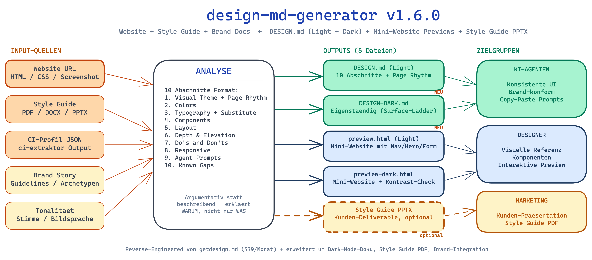

# design-md-generator

**Version:** 1.7.0
**Language of this file:** English · [Deutsche Version](README.md)

A reverse-engineering of the paid SaaS service [getdesign.md](https://getdesign.md/) — with more functionality and completely free. This skill extracts the visual design system from websites and design documents and generates a complete DESIGN.md (light mode + dark mode), interactive HTML previews, and an optional branded style guide.

---

## What is this skill for?

This skill is built for four very different use cases — all of them answering the same question: **"What does this design system look like, and how do I build inside it?"**

### 1. Competitive analysis

You want to understand how a competitor presents itself visually — which colors, which fonts, which component logic, which page rhythm. Instead of digging through DevTools by hand, you run this skill once and get a 10-section design document that captures the entire visual language. Useful for finding positioning gaps or for understanding why a competitor feels "premium" or "fresh."

### 2. Pattern hunting (design inspiration)

You found a website you like and want to use its patterns as a template — not 1:1, but as a blueprint. The skill gives you: color palette, typography hierarchy, button patterns, card patterns, spacing scale, shadow logic, page rhythm. You can either turn that into your own design system, or hand it off to an AI agent.

### 3. Fast briefing material

You want to give a designer, freelancer, or agency a feel for the desired look & feel in under 10 minutes. Instead of a mood board or a spec document: give them the DESIGN.md + the style-guide PPTX from two or three reference sites. It's faster than any briefing meeting and more precise than any written brief.

### 4. Claude Design / Claude Code briefings — your own site or pattern designs

The main use case for everyone who builds websites, apps, or UI with AI agents: a DESIGN.md is the **machine-readable briefing** that Claude Design, Cursor, Lovable, v0, or Claude Code understand. Instead of uploading screenshots and hoping the agent "gets the vibe," you hand it a structured DESIGN.md with all the tokens, component rules, and copy-paste agent prompts. The agent then builds consistently within the system.

Three concrete scenarios:

- **Rebuild your own site:** Let your existing site be analyzed and use the DESIGN.md as input for a relaunch with Claude Design — that guarantees visual continuity.
- **Generate pattern designs:** You want three landing-page variants "in the style of site X" — the DESIGN.md is the pattern training input for the agent.
- **Document a design system:** Your own site has no formal design system — analyze it, and you have a complete document at the push of a button.

---

## How this differs from getdesign.md

This skill is a reverse-engineering of the commercial [getdesign.md](https://getdesign.md/) service — it produces the same output (and therefore uses the same 10-section format), but goes further in several places:

| Feature | getdesign.md | design-md-generator |
|---------|--------------|---------------------|
| **Price** | Paid (SaaS) | Free |
| **DESIGN.md (light mode)** | Yes | Yes |
| **DESIGN-DARK.md (standalone)** | No | Yes |
| **Interactive HTML preview** | No | Yes (light + dark, as a mini-website) |
| **Style guide as a branded PPTX** | No | Yes |
| **Style guide PDF as input** | No | Yes |
| **Brand-document integration** | No | Yes (brand story, archetypes, tone of voice) |
| **Argumentative writing style (WHY, not just WHAT)** | No | Yes |
| **Page rhythm as a copy-paste pattern** | No | Yes |
| **Font-substitute recommendations** | No | Yes |
| **Known gaps (transparency section)** | No | Yes |
| **Stays in your system** | No (SaaS) | Yes (local, no cloud) |

**The key difference:** getdesign.md delivers a plain markdown document. design-md-generator also produces a **style guide** — so your client or team gets not just an agent briefing, but a professional PDF/PPTX presentation in the brand's design that works inside a pitch deck or as a brand guideline. That's the jump from "input for AI" to "deliverable for humans." And because the skill runs locally, everything stays inside your environment — no upload to third-party servers.

---

## Installation

```bash
cp -r ~/Documents/GitHub/claudecodeskills/design-md-generator ~/.claude/skills/
```

## Usage

```
/design-md-generator
```

Followed by the URL of the site to analyze. Optionally, a style guide can be passed as PDF, DOCX, or PPTX.

**Example:**
```
/design-md-generator https://example.com
```

**With style guide:**
```
/design-md-generator https://example.com + style guide PDF
```

The skill always asks for the target directory before writing any files.

---

## Overview: how the skill works



The diagram shows the full flow:

- **Inputs (left):** website URL, style guide, CI profile, brand story, tone-of-voice documents
- **Analysis (middle):** 10-section format with argumentative design logic
- **Outputs (right):** DESIGN.md, DESIGN-DARK.md, preview.html, preview-dark.html, style-guide PPTX

## Features

### 10-section format

The DESIGN.md follows a standardized format with 10 sections:

1. **Visual theme & atmosphere** — overall impression, design philosophy, key characteristics, page rhythm
2. **Color palette & roles** — colors with hex, CSS variable, official name, purpose
3. **Typography rules** — font family, hierarchy table, principles, font-substitute recommendations
4. **Component stylings** — buttons, cards, inputs, navigation, distinctive components
5. **Layout principles** — spacing, grid, whitespace, border-radius scale
6. **Depth & elevation** — shadow levels, shadow philosophy
7. **Do's and don'ts** — taken from the style guide + derived from CSS
8. **Responsive behavior** — breakpoints, collapsing strategy, touch targets
9. **Agent prompt guide** — quick reference, example prompts, iteration guide
10. **Known gaps** — what couldn't be extracted, limitations, substitution hints

### Standalone DESIGN-DARK.md

Dark mode is not an appendix but a fully self-contained document:

- Four-step surface ladder (canvas, surface, card, elevated)
- Text-opacity hierarchy (100% / 78% / 50% / 30%)
- Border-opacity hierarchy
- Its own agent prompts for dark-mode implementation
- Known gaps including a note on whether dark mode was native or derived

### Interactive HTML previews as mini-websites

Not a simple color catalog but real mini-websites with:

- Sticky nav with logo placeholder and CTA button
- Hero section with display headline and button variants
- Color palette, typography scale, button variants
- Card examples as three-column service tiles
- Form with label, input, textarea, checkbox, submit
- Spacing scale, border-radius scale, elevation/depth
- Footer with nav links and copyright

Delivered as `preview.html` (light) and `preview-dark.html` (dark).

### Five input sources

| Source | What it provides |
|--------|------------------|
| Website URL | Actually used CSS values |
| Style guide (PDF/DOCX/PPTX) | Official rules, color names, do's/don'ts |
| CI profile JSON | Pre-extracted colors/fonts |
| Brand guidelines / brand story | Personality, values, positioning |
| Archetype / tone-of-voice documents | Brand voice, image-language rules |

### Optional style guide as PPTX

After the DESIGN.md has been generated, the skill offers a style guide as PPTX:

- 6-8 slides in the brand's design (colors, fonts, layout of the analyzed brand)
- Cover, TOC, color palette, typography, components, layout, do's/don'ts
- No generic template — everything generated dynamically from the DESIGN.md
- Additional slides when brand documents are available (brand story, tone of voice)

**This is the core difference to getdesign.md:** the skill delivers not just an agent briefing but a professional client-facing document.

### Argumentative writing style

Section 1 (visual theme) explains not just WHAT the design does but WHY. Every design decision is justified: "Pill buttons (1000px radius) are the only interactive shape the system commits to — the soft rounding stands in deliberate contrast to the hard uppercase headlines."

### Page rhythm as a concrete pattern

The page rhythm is documented as a copy-paste-ready build instruction for AI agents, e.g.:
"Dark hero -> cream service tiles -> dark portrait interstitial -> cream feature with accent CTA -> landscape photo -> dark footer"

### Font-substitute recommendations

When a site uses proprietary fonts, the skill always recommends open-source alternatives with similar metrics and notes on any necessary fine-tuning (e.g. line-height adjustments).

### Known gaps for transparency

Section 10 honestly documents what could NOT be extracted:

- Proprietary fonts that aren't available
- Animations / transitions not visible in static CSS
- Number of analyzed pages and patterns that might be missing
- Missing status colors or icon systems

### Target-directory prompt

Before writing any files, the skill always asks for the desired target directory (current directory, specific folder, or desktop).

---

## Background & sources

This skill is a **reverse-engineering of the commercial service [getdesign.md](https://getdesign.md/)**, which generates DESIGN.md files from websites. It adopts the established 10-section format (minus the known-gaps section — that's added here) and extends it along several dimensions that getdesign.md does not offer — first and foremost the **automatically generated style guide as a branded PPTX**.

**Why this was built in the first place:** DESIGN.md has established itself as the de-facto standard for agent briefings in 2026. Anyone who seriously works with Claude Design, Cursor, Lovable, v0, or Claude Code needs design systems in this format. If you do more than a handful of analyses a month, the SaaS subscription stops making sense — and if you work with sensitive client sites, you don't want cloud uploads. This skill solves both.

**Sources and foundations:**

- [getdesign.md](https://getdesign.md/) — methodological foundation (the 10-section format)
- [defuddle CLI](https://github.com/kepano/defuddle) — CSS extraction from websites
- Claude Code PDF/DOCX/PPTX skills — style-guide ingestion
- Own extensions: surface ladder, text-opacity hierarchy, PPTX style guide

---

## File structure

```
design-md-generator/
├── README.md                              <- German version
├── README.en.md                           <- This file
├── SKILL.md                               <- Skill definition and workflow (DE)
├── SKILL.en.md                            <- Skill definition (EN)
├── overview.excalidraw                    <- Overview diagram (editable)
├── overview.png                           <- Overview diagram (rendered)
└── references/
    ├── design-md-format.md                <- DESIGN.md format reference
    ├── preview-template.html              <- HTML preview template (light)
    └── preview-dark-template.html         <- HTML preview template (dark)
```

## Generated output files

| File | Description |
|------|-------------|
| `DESIGN.md` | Design system (light mode), 10 sections |
| `DESIGN-DARK.md` | Design system (dark mode), standalone |
| `preview.html` | Interactive mini-website preview (light) |
| `preview-dark.html` | Interactive mini-website preview (dark) |
| `styleguide-[brand].pptx` | Optional style guide in the brand's design |
