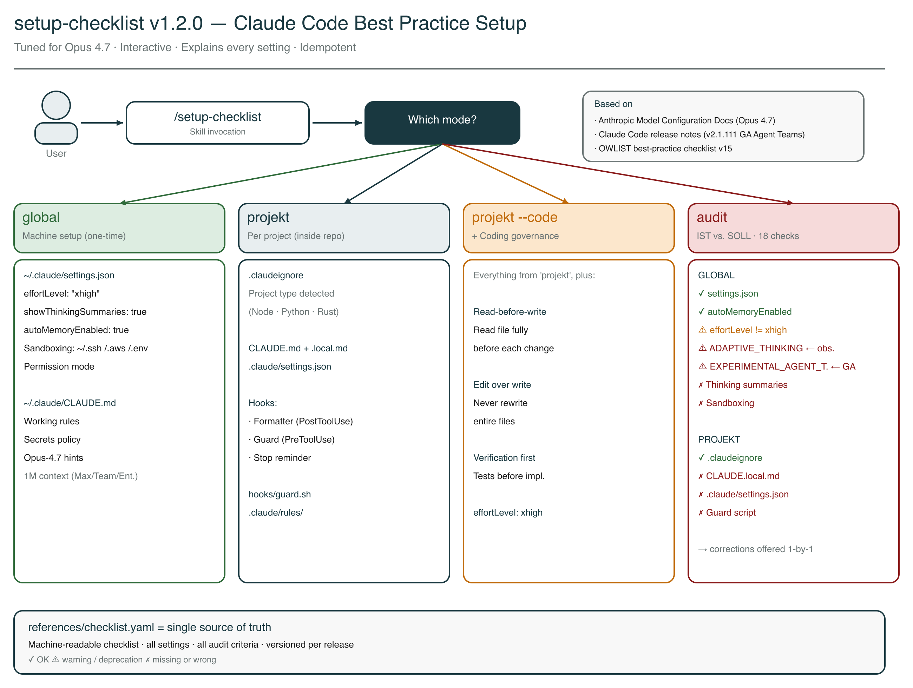

# Setup-Checklist Skill

Interactive setup assistant for Claude Code, tuned for Opus 4.7. The skill configures `settings.json`, `CLAUDE.md`, `.claudeignore`, hooks, and rules — globally or per project — and explains *why* each setting matters, rather than just copying config files.



> Working language of the skill is German. Triggers (`setup`, `einrichten`, `bootstrapping`, `audit`) and all interactive prompts remain German. This English README describes what the skill does and how to install it.

## What this skill handles for you

Claude Code has 50+ configurable settings, hooks, rules, and permission modes. Anthropic's official docs are comprehensive but spread out. This skill bundles the important best practices into a guided sequence:

- **Correct `settings.json`** — `effortLevel: "xhigh"`, `showThinkingSummaries`, `autoMemoryEnabled`, sandboxing, permission mode
- **`CLAUDE.md` with clear working rules** — read-before-write, edit-over-write, secrets policy
- **Per-project hygiene** — `.claudeignore`, hooks (formatter / guard / stop reminder), modular rules
- **Audit** — IST/SOLL comparison with concrete correction offers, including warnings for deprecated Opus-4.6 env variables

## Version

**v1.2.0** (April 2026) — tuned for Opus 4.7, based on checklist v15 (OWLIST GmbH).

## Installation

```bash
cp -r ~/Documents/GitHub/claudecodeskills/setup-checklist ~/.claude/skills/setup-checklist
```

Verify it works:

```
/setup-checklist
```

Without arguments the skill asks which mode you want.

## Four modes

### 1. `/setup-checklist global` — machine setup

One-time setup for all projects. The skill steps through each setting, explains the background, and asks yes/no:

| Setting | Recommendation | Why |
|---|---|---|
| `effortLevel` | `"xhigh"` | Opus 4.7 engineering default. Values: low, medium, high, xhigh, max. On pay-as-you-go / Pro plans you can later lower it to `high` or `medium` in `~/.claude/settings.json`. |
| `showThinkingSummaries` | `true` | Diagnostic tool — shows whether Claude is thinking thoroughly or cutting corners |
| `autoMemoryEnabled` | `true` | Persistent learning between sessions |
| Sandboxing | enabled | Protects `~/.ssh/`, `~/.aws/`, `.env` from accidental access |
| Permission mode | `manual` | Default safety mode (auto/custom optional) |

Plus: `~/.claude/CLAUDE.md` with working rules, secrets policy, and model hints for Opus 4.7 (1M context is automatic on Max/Team/Enterprise plans).

**Two env variables are no longer part of the setup in v1.2.0:**
- `CLAUDE_CODE_DISABLE_ADAPTIVE_THINKING` — obsolete since Opus 4.7 (flag only applies to 4.6)
- `CLAUDE_CODE_EXPERIMENTAL_AGENT_TEAMS` — GA since Claude Code v2.1.111

The audit mode warns if these are still set and offers to remove them.

### 2. `/setup-checklist projekt` — project setup

Setup for a single project (run in the project folder). Detects project type (Node.js / Python / Rust) and creates:

- `.claudeignore` — adapted to project type
- `CLAUDE.md` — project template with build commands and rules
- `CLAUDE.local.md` — personal overrides (+ `.gitignore` entry)
- `.claude/settings.json` — permissions + hooks (formatter, guard, stop reminder)
- `hooks/guard.sh` — protects sensitive files from Claude access
- `.claude/rules/` — modular rule files for lazy loading

### 3. `/setup-checklist projekt --code` — with coding governance

Everything from project mode, plus strict rules:

- **Read-before-write** — read files fully before any change
- **Edit over write** — edit existing files, don't overwrite
- **Verification first** — tests before implementation
- **effortLevel: xhigh** anchored at project level

### 4. `/setup-checklist audit` — best-practice audit

Checks 18 criteria (9 global, 9 project) and shows a report:

```
GLOBAL (~/.claude/)
  ✓ settings.json present
  ✓ autoMemoryEnabled: true
  ⚠ effortLevel: high (recommended for Opus 4.7: xhigh)
  ⚠ CLAUDE_CODE_DISABLE_ADAPTIVE_THINKING still set (obsolete since Opus 4.7)
  ⚠ CLAUDE_CODE_EXPERIMENTAL_AGENT_TEAMS still set (GA since v2.1.111)
  ✗ Thinking summaries not enabled
  ✗ Sandboxing not configured
  ✓ CLAUDE.md present (142 lines)
  ✓ Secrets policy present

RESULT: 5/18 checks passed, 3 deprecation warnings
```

For every ⚠ or ✗ the skill offers to correct it individually.

## Guiding principles

- **NEVER overwrite existing files** without explicit confirmation
- **ALWAYS explain** what a setting does and why it is recommended
- **Idempotent** — can be run any number of times without harm
- **Merge rather than replace** — existing `settings.json` is merged, only missing keys added
- **Detect project type** and adapt templates accordingly
- **German** as working language for explanations and prompts

## History: Adaptive Thinking Regression (Opus 4.6, Summer 2025 — March 2026)

> Context for anyone familiar with the previous version. The problem is solved with Opus 4.7.

In summer 2025 Anthropic introduced **Adaptive Thinking** — Claude adjusts reasoning depth dynamically based on perceived task complexity. In March 2026 Stella Laurenzo (Director AI, AMD) published an analysis on GitHub (Issue #2654): 6,852 sessions, 234,760 tool calls. Measurable quality drop — reads before edits fell from 6.6 to 2.0, entire files were rewritten instead of edited precisely, "ownership dodging" rose from 0 to 10 per day.

Mitigation in v1.1.0 of this skill: `CLAUDE_CODE_DISABLE_ADAPTIVE_THINKING=1`.

**Redesigned with Opus 4.7:** Adaptive thinking runs permanently and reliably, fixed thinking budgets no longer exist, and the flag has no effect. The v1.2.0 skill removes the flag from the template and warns in audit mode if it is still set.

## Sources

- [Official Anthropic Claude Code Documentation](https://docs.anthropic.com/en/docs/claude-code)
- [Claude Code Model Configuration](https://code.claude.com/docs/en/model-config) — effortLevel, adaptive thinking, 1M context
- [What's new in Claude Opus 4.7](https://platform.claude.com/docs/en/about-claude/models/whats-new-claude-4-7)
- [GitHub Issue #2654](https://github.com/anthropics/claude-code/issues/2654) — Stella Laurenzo (AMD): thinking-depth analysis (historical reference, 4.6 era)
- Claude Code Best Practice Checklist v15 (OWLIST GmbH, April 2026, Opus-4.7 update)

## File structure

```
setup-checklist/
├── SKILL.md                          <- Skill logic (German)
├── SKILL.en.md                       <- English version
├── README.md                         <- German README
├── README.en.md                      <- This file
├── setup-checklist-overview.excalidraw <- Overview diagram (German labels)
├── setup-checklist-overview.png
├── setup-checklist-overview.en.excalidraw
├── setup-checklist-overview.en.png
└── references/
    ├── checklist.yaml                <- Machine-readable checklist (v15, 18 audit checks)
    └── templates/
        ├── settings-global.json
        ├── settings-projekt.json
        ├── claude-md-global.md
        ├── claude-md-projekt.md
        ├── claude-local-md.md
        ├── claudeignore
        ├── guard.sh
        ├── coding-style.md
        ├── api-security.md
        └── agent-patterns.md
```

## Version history

- **v1.2.0** (2026-04-21): Opus-4.7 update. `effortLevel` default raised to `"xhigh"`. `CLAUDE_CODE_DISABLE_ADAPTIVE_THINKING` and `CLAUDE_CODE_EXPERIMENTAL_AGENT_TEAMS` removed from template (obsolete / GA). Audit warns about deprecated env variables and offers removal. CLAUDE.md template extended with Opus-4.7 and 1M context hints. English doc variant + new Excalidraw diagram. Checklist v15.
- **v1.1.0** (2026-04-14): Adaptive thinking regression + interactive setup flow. New settings: `CLAUDE_CODE_DISABLE_ADAPTIVE_THINKING`, `showThinkingSummaries`. Interactive GLOBAL mode. Audit extended to 18 checks. Based on checklist v14.
- **v1.0.1** (2026-04-13): $schema URL fix, consistency fix (v12, audit 6/16)
- **v1.0.0** (2026-04-12): First release
