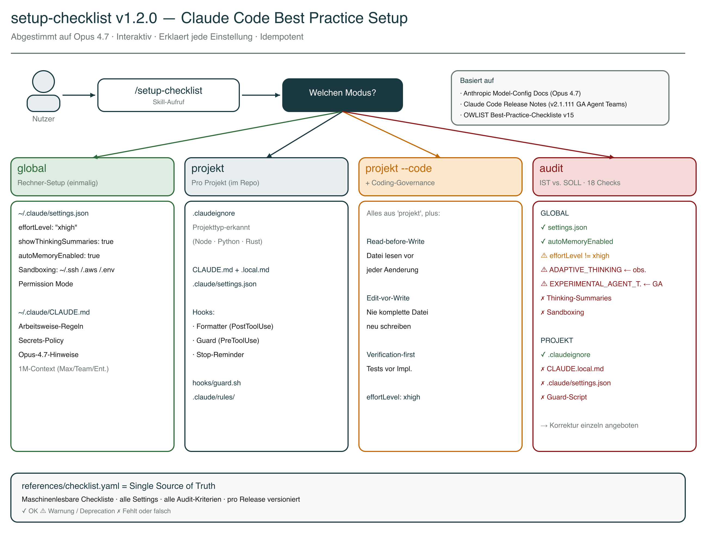

# Setup-Checklist Skill

Interaktiver Setup-Assistent fuer Claude Code, abgestimmt auf Opus 4.7. Der Skill konfiguriert `settings.json`, `CLAUDE.md`, `.claudeignore`, Hooks und Rules — pro Rechner oder pro Projekt — und erklaert bei jeder Einstellung *warum* sie sinnvoll ist, statt nur Config-Dateien zu kopieren.



## Was dieser Skill dir abnimmt

Claude Code hat ueber 50 konfigurierbare Einstellungen, Hooks, Rules und Permission-Modi. Die offizielle Anthropic-Doku ist umfangreich, aber verteilt. Dieser Skill buendelt die wichtigsten Best Practices in einer gefuehrten Sequenz:

- **`settings.json` richtig gesetzt** — `effortLevel: "xhigh"`, `showThinkingSummaries`, `autoMemoryEnabled`, Sandboxing, Permission Mode
- **`CLAUDE.md` mit klaren Arbeits-Regeln** — Read-before-Write, Edit-vor-Write, Secrets-Policy
- **Pro-Projekt-Hygiene** — `.claudeignore`, Hooks (Formatter / Guard / Stop-Reminder), ausgelagerte Rules
- **Audit** — IST/SOLL-Abgleich mit konkreten Korrektur-Angeboten, inkl. Warnung bei veralteten Opus-4.6-Env-Variablen

## Version

**v1.2.0** (April 2026) — abgestimmt auf Opus 4.7, basiert auf Checkliste v15 (OWLIST GmbH).

## Installation

```bash
cp -r ~/Documents/GitHub/claudecodeskills/setup-checklist ~/.claude/skills/setup-checklist
```

Pruefen ob es funktioniert:

```
/setup-checklist
```

Ohne Argument fragt der Skill, welchen Modus du moechtest.

## Vier Modi

### 1. `/setup-checklist global` — Rechner-Setup

Einmaliges Setup fuer alle Projekte. Der Skill geht jedes Setting einzeln durch, erklaert den Hintergrund und fragt ja/nein:

| Setting | Empfehlung | Warum |
|---|---|---|
| `effortLevel` | `"xhigh"` | Opus-4.7-Engineering-Default. Werte: low, medium, high, xhigh, max. Bei Pay-as-you-go / Pro-Abo nachtraeglich auf `high` oder `medium` reduzierbar. |
| `showThinkingSummaries` | `true` | Diagnose-Tool — zeigt ob Claude gruendlich denkt oder abkuerzt |
| `autoMemoryEnabled` | `true` | Persistentes Learning zwischen Sessions |
| Sandboxing | aktiv | Schuetzt `~/.ssh/`, `~/.aws/`, `.env` vor versehentlichem Zugriff |
| Permission Mode | `manual` | Standard-Sicherheitsmodus (auto/custom optional) |

Plus: `~/.claude/CLAUDE.md` mit Arbeitsweise-Regeln, Secrets-Policy und Modell-Hinweisen zu Opus 4.7 (1M-Context bei Max/Team/Enterprise automatisch aktiv).

**Zwei Env-Variablen sind in v1.2.0 nicht mehr Teil des Setups:**
- `CLAUDE_CODE_DISABLE_ADAPTIVE_THINKING` — obsolet seit Opus 4.7 (Flag greift nur bei 4.6)
- `CLAUDE_CODE_EXPERIMENTAL_AGENT_TEAMS` — GA seit Claude Code v2.1.111

Der Audit-Modus warnt, wenn diese noch gesetzt sind, und bietet Entfernung an.

### 2. `/setup-checklist projekt` — Projekt-Setup

Setup fuer ein einzelnes Projekt (im Projektordner ausfuehren). Erkennt Projekttyp (Node.js / Python / Rust) und legt an:

- `.claudeignore` — angepasst an Projekttyp
- `CLAUDE.md` — Projekt-Template mit Build-Commands und Regeln
- `CLAUDE.local.md` — persoenliche Overrides (+ `.gitignore`-Eintrag)
- `.claude/settings.json` — Permissions + Hooks (Formatter, Guard, Stop-Reminder)
- `hooks/guard.sh` — schuetzt sensible Dateien vor Claude-Zugriff
- `.claude/rules/` — ausgelagerte Regelwerke fuer Lazy Loading

### 3. `/setup-checklist projekt --code` — mit Coding-Governance

Alles aus dem Projekt-Modus, plus strenge Regeln:

- **Read-before-Write** — Dateien vollstaendig lesen vor jeder Aenderung
- **Edit-vor-Write** — bestehende Dateien editieren, nicht ueberschreiben
- **Verification-first** — Tests vor Implementierung
- **effortLevel: xhigh** auch projekt-lokal verankert

### 4. `/setup-checklist audit` — Best-Practice-Audit

Prueft 18 Kriterien (9 global, 9 projekt) und zeigt einen Report:

```
GLOBAL (~/.claude/)
  ✓ settings.json vorhanden
  ✓ autoMemoryEnabled: true
  ⚠ effortLevel: high (empfohlen fuer Opus 4.7: xhigh)
  ⚠ CLAUDE_CODE_DISABLE_ADAPTIVE_THINKING noch gesetzt (obsolet seit Opus 4.7)
  ⚠ CLAUDE_CODE_EXPERIMENTAL_AGENT_TEAMS noch gesetzt (GA seit v2.1.111)
  ✗ Thinking-Summaries nicht aktiviert
  ✗ Sandboxing nicht konfiguriert
  ✓ CLAUDE.md vorhanden (142 Zeilen)
  ✓ Secrets-Policy vorhanden

ERGEBNIS: 5/18 Checks bestanden, 3 Deprecation-Warnungen
```

Fuer jeden ⚠ oder ✗ bietet der Skill an, einzeln zu korrigieren.

## Leitprinzipien

- **NIEMALS bestehende Dateien ueberschreiben** ohne explizite Bestaetigung
- **IMMER erklaeren** was eine Einstellung tut und warum sie empfohlen wird
- **Idempotent** — beliebig oft ausfuehrbar ohne Schaden
- **Merge statt Replace** — bestehende `settings.json` wird gemerged, nur fehlende Keys ergaenzt
- **Projekttyp erkennen** und Templates entsprechend anpassen
- **Deutsch** als Arbeitssprache fuer Erklaerungen und Ausgaben

## Historie: Adaptive Thinking Regression (Opus 4.6, Sommer 2025 — Maerz 2026)

> Kontext-Info fuer alle, die die Vorgaenger-Version kennen. Mit Opus 4.7 ist das Problem geloest.

Im Sommer 2025 fuehrte Anthropic **Adaptive Thinking** ein — Claude passt die Reasoning-Tiefe dynamisch an die vermutete Komplexitaet an. Im Maerz 2026 veroeffentlichte Stella Laurenzo (Director AI, AMD) eine Analyse auf GitHub (Issue #2654): 6.852 Sessions, 234.760 Tool Calls. Messbarer Qualitaetsabfall — Reads vor Edits fielen von 6.6 auf 2.0, ganze Dateien wurden neu geschrieben statt gezielt editiert, "Ownership Dodging" stieg von 0 auf 10 pro Tag.

Gegenmassnahme in v1.1.0 dieses Skills: `CLAUDE_CODE_DISABLE_ADAPTIVE_THINKING=1`.

**Mit Opus 4.7 neu designt:** Adaptive Thinking laeuft permanent und zuverlaessig, Fixed-Thinking-Budgets gibt es nicht mehr, das Flag greift nicht. Der v1.2.0-Skill entfernt das Flag aus dem Template und warnt im Audit, wenn es noch gesetzt ist.

## Quellen

- [Offizielle Anthropic Claude Code Dokumentation](https://docs.anthropic.com/en/docs/claude-code)
- [Claude Code Model Configuration](https://code.claude.com/docs/en/model-config) — effortLevel, Adaptive Thinking, 1M-Context
- [What's new in Claude Opus 4.7](https://platform.claude.com/docs/en/about-claude/models/whats-new-claude-4-7)
- [GitHub Issue #2654](https://github.com/anthropics/claude-code/issues/2654) — Stella Laurenzo (AMD): Thinking-Depth-Analyse (historische Referenz, 4.6-Aera)
- Claude Code Best Practice Checkliste v15 (OWLIST GmbH, April 2026, Opus-4.7-Update)

## Dateistruktur

```
setup-checklist/
├── SKILL.md                          <- Skill-Logik (Modus-Erkennung, Ablauf, Regeln)
├── SKILL.en.md                       <- Englische Version
├── README.md                         <- Diese Datei
├── README.en.md                      <- Englische Version
├── setup-checklist-overview.excalidraw <- Uebersichtsdiagramm (Excalidraw, DE)
├── setup-checklist-overview.png        <- Uebersichtsdiagramm (gerendert, DE)
├── setup-checklist-overview.en.excalidraw
├── setup-checklist-overview.en.png
└── references/
    ├── checklist.yaml                <- Maschinenlesbare Checkliste (v15, 18 Audit-Checks)
    └── templates/
        ├── settings-global.json      <- ~/.claude/settings.json Vorlage
        ├── settings-projekt.json     <- .claude/settings.json mit Hooks
        ├── claude-md-global.md       <- ~/.claude/CLAUDE.md Vorlage
        ├── claude-md-projekt.md      <- Projekt-CLAUDE.md Vorlage
        ├── claude-local-md.md        <- CLAUDE.local.md Vorlage
        ├── claudeignore              <- .claudeignore Vorlage
        ├── guard.sh                  <- Guard-Script (PreToolUse-Hook)
        ├── coding-style.md           <- Coding-Style Rules
        ├── api-security.md           <- API Security Rules
        └── agent-patterns.md         <- Agent-Team-Patterns
```

## Versionshistorie

- **v1.2.0** (2026-04-21): Opus-4.7-Update. `effortLevel` Default auf `"xhigh"` gehoben. `CLAUDE_CODE_DISABLE_ADAPTIVE_THINKING` und `CLAUDE_CODE_EXPERIMENTAL_AGENT_TEAMS` entfernt (obsolet bzw. GA). Audit warnt bei veralteten Env-Vars und bietet Entfernung an. CLAUDE.md-Template um Opus-4.7- und 1M-Context-Hinweise erweitert. Englische Doku-Variante + neues Excalidraw-Diagramm. Checkliste v15.
- **v1.1.0** (2026-04-14): Adaptive Thinking Regression + interaktiver Setup-Flow. Neue Settings: `CLAUDE_CODE_DISABLE_ADAPTIVE_THINKING`, `showThinkingSummaries`. Interaktiver GLOBAL-Modus. Audit auf 18 Checks. Basiert auf Checkliste v14.
- **v1.0.1** (2026-04-13): Fix $schema-URL, Konsistenz-Fix (v12, Audit 6/16)
- **v1.0.0** (2026-04-12): Erster Release
